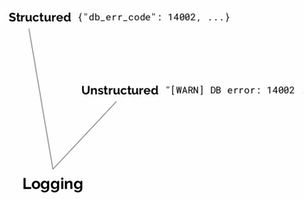

<p></p>
<!-- more -->

##  Log 模型[1]


## 日志框架
+ ELK，EFK  
+ Loki  
  基于tag  

## 日志采集
+ Java应用中
  + API
    + log4j
  + 基于AOP的采集[4]
    ``` Java
    @LogRecord(
     content = "修改了订单的配送地址：从“#oldAddress”, 修改到“#request.address”",
     operator = "#request.userName", bizNo="#request.deliveryOrderNo")
    public void modifyAddress(updateDeliveryRequest request, String oldAddress){
    // 更新派送信息 电话，收件人、地址
    doUpdate(request);
    }
    ```
+ 容器中[2]
  

## 参考
1. 《第七模块 ：微服务监控告警Prometheus架构和实践 119.监控模式分类》 微服务架构实战160讲 杨波 partial
2. [容器日志采集利器Log-Pilot](https://yq.aliyun.com/articles/674327)  阿里Log-Pilot 容器日志采集模式 停止更新
3. [Pattern: Microservice Architecture](https://microservices.io/patterns/microservices.html)  
4. [如何优雅地记录操作日志？](https://tech.meituan.com/2021/09/16/operational-logbook.html)  美团 ***  
1xx. [日志：每个软件工程师都应该知道的有关实时数据的统一概念](https://github.com/oldratlee/translations/blob/master/log-what-every-software-engineer-should-know-about-real-time-datas-unifying/README.md)  论文翻译 *** 未  