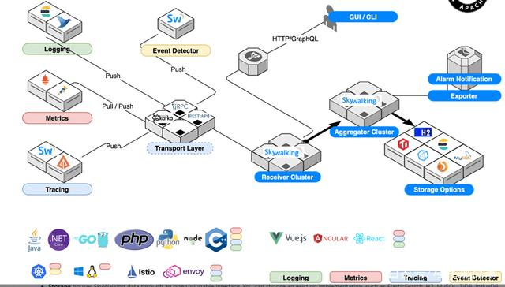

<!-- more -->

# 定位
APM: Tracing + Metric

# 架构[2]

### agent
+ rpc  
  dubbo，springboot  
+ mesh   
  istio, envoy  
+ 中间件  
  nginx, kong  
  tomcat   
+ db  
  mysql  
+ linux  
  ebpf  
+ k8s  

# 特性 [1]
+ skywalking
  - 强依赖传输协议,  head传输协议特殊   
    可以存zipkin，jaeger，openTelemetry的数据，但是不能tracing(拓扑图)分析  
  - **Metrics Analysis Language**
    - metric 前置分析
    - 优势 
      - 提供更加一致性的查询结果 
      - 成本
    - 劣势 
      - 丧失灵活性
      - 精细的数据查不到
   - logging
     - es  
       慢 费钱  
     - **Parse loging from Text**  
       like loki,  log前置分析  
       - 通过label而不是正文查log  
     - Generate Metrics from logs
   - Event事件

# live demo 
[live demo](http://demo.skywalking.apache.org/general)

## 参考
1. [开源可观测体系发展之路 - 吴晟 @ 得物技术沙龙](https://www.bilibili.com/video/BV1Bk4y1L7T2/) V *** 
2. [SkyWalking分布式系统应用程序性能监控工具-上](https://www.cnblogs.com/itxiaoshen/p/16513711.html)

+ [java基础教程全面的深入学习Skywalking](https://www.bilibili.com/video/BV1ZJ411s7Mn) V 入门  
+ [安装Java agent](https://skyapm.github.io/document-cn-translation-of-skywalking/zh/8.0.0/setup/service-agent/java-agent/)  

### 资源
+ [ApacheSkyWalking](https://space.bilibili.com/390683219)  V  

1xx. [SkyWalking 在无人驾驶领域的实践](https://skywalking.apache.org/zh/2022-04-13-skywalking-in-autonomous-driving/)   golang集成skywalking  
