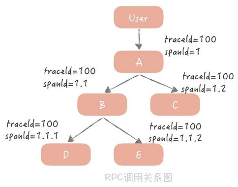
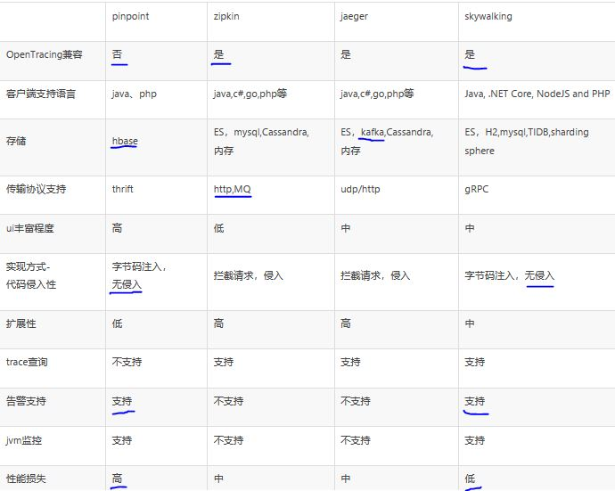
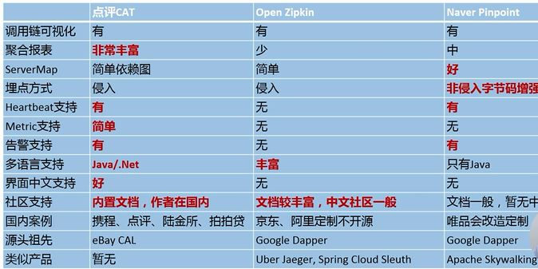

<!-- more -->

# 原理 [0]

#  APM 产品
### APM产品比对 [5]

### APM产品比对 [6]

# 使用 [9]
###   APM 故障排查
   
      
###    APM 稳定性指标
   

# 参考
##### 标准&原理
0. 《25 | 分布式Trace：横跨几十个分布式组件的慢请求要如何排查？》
1. [OpenTracing语义标准](https://github.com/opentracing-contrib/opentracing-specification-zh/blob/master/specification.md)  archived
2. [opentracing文档中文版](https://wu-sheng.gitbooks.io/opentracing-io/content/pages/spec.html) archived
3. [Dapper，大规模分布式系统的跟踪系统](http://bigbully.github.io/Dapper-translation/)  论文

##### 业界
4. [虾米SRE实践_监控体系升级之路](https://github.com/StabilityMan/StabilityGuide/blob/master/docs/processing/monitor/%E8%99%BE%E7%B1%B3SRE%E5%AE%9E%E8%B7%B5_%E7%9B%91%E6%8E%A7%E4%BD%93%E7%B3%BB%E5%8D%87%E7%BA%A7%E4%B9%8B%E8%B7%AF.md) ***
5. [分布式调用链调研（pinpoint,skywalking,jaeger,zipkin等对比）](https://my.oschina.net/u/3770892/blog/3005395)  对比的表格 *** 失效
6.《第四模块 ：微服务调用链监控CAT架构和实践 69.调用链监控产品和比较》 微服务架构实战160讲  杨波
1xx. [剖析 | SOFARPC 框架之 SOFARPC 链路追踪剖析](https://www.sofastack.tech/blog/sofa-rpc-link-tracking/) 

##### 使用
8. [如何检测 Web 服务请求丢失问题](https://mp.weixin.qq.com/s/QA_BTF1D3GJJ7_nYQ6oAzQ) 问题排查 应用： Nginx tracing + Tomcat tracing
9. [鹰眼跟踪、限流降级，EDAS的微服务解决之道](https://yq.aliyun.com/articles/60994?spm=5176.100239.blogcont61320.29.6SwFH6)

