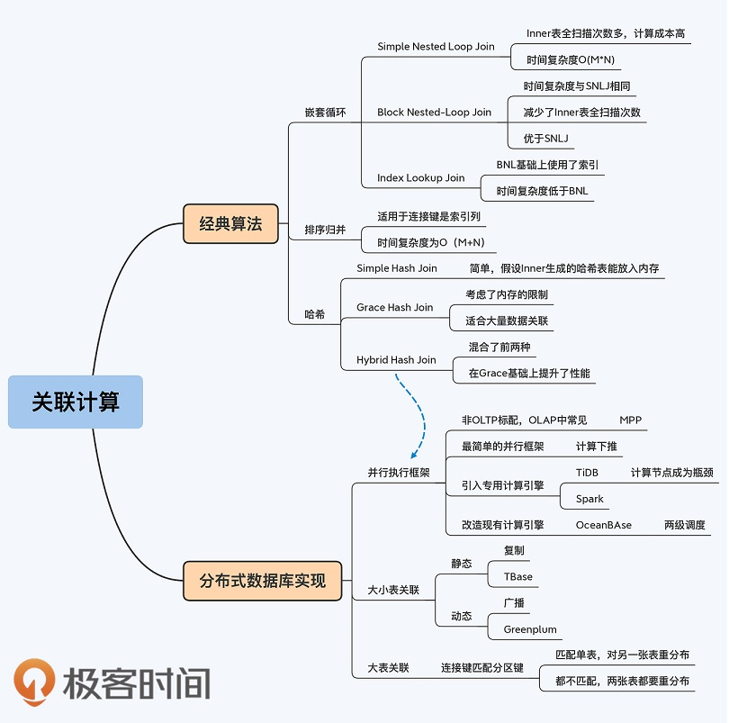

<!-- more -->

## TiDB 的 Join 算法[2][5]
+ TiDB 的 Join 算法包括如下几类：
   - Hash Join
   - Merge Join
   - Index Hash Join
   - Index Merge Join

+ TiDB 目前表 Join 的方式 [3][4]
  - Sort Merge Join
  - Index Nested Loop Join
  - Hash Join
  
## 参考
1. 《20 | 关联查询：如何提升多表Join能力？ 》
2. [TiDB 查询优化及调优系列（二）TiDB 查询计划简介](https://cn.pingcap.com/blog/tidb-query-optimization-and-tuning-2)  **查看 Join 的执行计划**
3. [TiDB 源码阅读系列](https://cn.pingcap.com/blog/?tag=TiDB%20%E6%BA%90%E7%A0%81%E9%98%85%E8%AF%BB)
4. [TiDB 查询优化及调优系列（四）查询执行计划的调整及优化原理](https://cn.pingcap.com/blog/tidb-query-optimization-and-tuning-4)
5. [JOIN 查询的执行计划 比较](https://tidb.net/blog/cf459d89)

