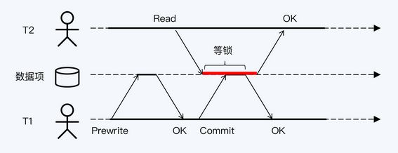

<!-- more -->

# 原理 
### Percolator  [1]

  总体来说就是一个经过**优化的 2PC** 的实现，依赖一个**单点的授时服务 TSO** 来实现单调递增的事务编号生成，提供**SI 的隔离级别**。

### TiKV 的写事务分为两个阶段  [1]
+ 1、Prewrite 阶段
  MVCC 在对应传统 2PC 的第一阶段的 prewrite 流程。
  首先选出一个 primary row 和其他的 secondary rows，然后对 primary row 进行上锁，再对 secondary rows 进行类似的上锁流程。如果任何一步出错，都会进行回滚。完成 prewrite 阶段后，进入 commit 阶段，当前时间戳为 commitTs，TSO 会保证 commitTs > startTs。

+ 2、Commit 阶段
  MVCC 中的 Commit 流程，包括在 primary 上写入 meta，删除 Lock 标记，以及异步提交 secondaries。如果 primary row 提交失败，则整个事务回滚。如果成功，则标志着整个事务提交成功。

+ Tidb乐观锁 [2]

+ Tidb悲观锁 [2]

### TiKV 的读事务  [1]
  在事务中进行读操作的过程。
  **首先，需要检查行是否被锁定，如果被锁定，则需要等待或者清除锁。然后，需要读取最新的数据版本，方法是读取元数据并找到最大的时间戳。** 锁分为两级，Primary和Secondary row，只有Primary row的锁被释放，事务才算提交成功。Secondary row的提交可以异步进行，但在此过程中可能需要清理锁。即使Secondary row提交失败，也可以通过锁找到Primary row，并根据元数据确定事务是回滚还是提交成功。

> TiKV 的事务默认隔离级别是 Repeatable Read（SI）, 也对外暴露显式的加锁的 API，用于为客户端实现 SELECT … FOR UPDATE 等隔离级别为 SSI 的语句。

###  读写冲突处理 [3]

# 参考

1. [TiKV 事务模型概览，Google Spanner 开源实现](https://cn.pingcap.com/blog/tidb-transaction-model)  *** 
2. 《13 | 隔离性：为什么使用乐观协议的分布式数据库越来越少? 》  分布式数据库30讲
3. 《11｜隔离性：读写冲突时，快照是最好的办法吗？》 分布式数据库30讲
96. [percolator的理解与开源实现分析](https://zhuanlan.zhihu.com/p/149377959)   未
97. [Percolator - 分布式事务的理解与分析](https://zhuanlan.zhihu.com/p/261115166)   未
98. 《云原生数据库 原理与实践》 8.1.3   未
99. [TiDB 新特性漫谈：悲观事务](https://cn.pingcap.com/blog/pessimistic-transaction-the-new-features-of-tidb) 未
100.   self