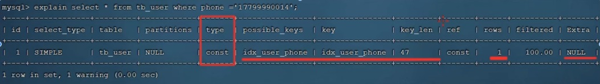

<p></p>
<!-- more -->


##  索引-结构

#####  索引分类[7]


| 分类     | 含义                                                 | 特点                     | 关键字   |
| -------- | ---------------------------------------------------- | ------------------------ | -------- |
| **主键索引** | 针对于表中主键创建的索引                             | 默认自动创建，只能有一个 | **PRIMARY**  |
| **唯一索引** | 避免同一个表中某数据列中的值重复                     | 可以有多个               | **UNIQUE**   |
| 常规索引 | 快速定位特定数据                                     | 可以有多个               |          |
| 全文索引 | 全文索引查找的是文本中的关键词，而不是比较索引中的值 | 可以有多个               | FULLTEXT |

| 分类                      | 含义                                                       | 特点                     |
| ------------------------- | ---------------------------------------------------------- | ------------------------ |
| **聚集索引(Clustered Index)** | 将数据存储与索引放一块，索引结构的叶子节点保存了行数据     | **必须有，而且只有一个** |
| **二级索引(Secondary Index)** | 将数据与索引分开存储，索引结构的叶子节点关联的是对应的主键 | 可以存在多个             |


+ 聚集索引选取规则:
  - 如果存在主键，主键索引就是聚集索引
  - 如果不存在主键，将使用第一个唯一（UNIQUE）索引作为聚集索引。
  - 如果表没有主键，或没有合适的唯一索引，则InnoDB会自动生成一个rowid作为隐藏的聚集索 引。

#####  索引结构和存储引擎 [3]

索引的数据结构： B+树能够很好地配合磁盘的读写特性，减少单次查询的磁盘访问次数


 index | MyISAM  |  InnoDB | Memory
:-: | :-: | :-: | :-:
 B-Tree<br>（balanced 平衡的）  | 支持 | 支持  | 支持
 Hash        | 不支持 | 不支持  | 支持
 R-Tree <br>空间索引 |  支持| 不支持 | 不支持
 Full-text    | 支持| 支持 | 不支持


#####  复合索引的数据结构  

```
create table people {
  last_name,
  first_name,
  dob,
  gender,
  key(last_name, first_name, dob)
}
```


## 索引- 使用

#####  索引的使用场景 
 索引的使用场景 | 例子
 :-: | :-: 
 匹配全值  |  index (a,b,c) <br> a=1 and b=2 and c=3
 范围查找  |  index a>1 and b<3 
 匹配最左前缀  |  index(a，b，c)  <br> a OR a，b OR a、b、c OR a，c 会使用 <br>  b、c 不使用
 仅对索引列进行查询（覆盖索引）  |  index  a <br> a=1
  匹配列前缀 | index （a， b） <br> a like 'WEER%'    
  Index Condition Pushdown（ICP） |  减少回表IO     

#####  索引的失效   [12][7]
+ 非复合索引
 索引失效(不会使用index的场景) | 例子| 解释 
 :-: | :-: | :-: 
 在索引列上进行运算操作 | substring(phone,10,2) | **对索引字段做函数操作，可能会破坏索引值的有序性，因此优化器就决定放弃走树搜索功能。** 
 模糊查询, 头部模糊匹配 | like "%NI" |
 字符串类型字段使用时，不加引号[隐式转换] | lastname=1  不使用索引 <br>lastname='1'  使用索引| **隐式类型转换**， **隐式字符编码转换**，等价于在索引字段上做函数操作而导致了全索引扫描。 
 or连接条件 | index a <br>  a=3 or c=6 or d=9| 如果or前的条件中的列有索引，而后面的列中没有索引，那么涉及的索引都不会被用到. 当or连接的条件，左右两侧字段都有索引时，索引才会生效。 

+ 复合索引[7]
  + 最左前缀原则
  如果索引关联了多列（联合索引），要遵守最左前缀法则，最左前缀法则指的是查询从索引的最左列开始，并且不跳过索引中的列。**如果跳跃某一列，索引将部分失效（后面的字段索引失效）。**  
  + 范围查询
    联合索引中，**出现范围查询(>,<)，范围查询右侧的列索引失效**。
    ```mysql
    explain select * from tb_user where profession = '软件工程' and age >= 30 and status = '0';
    ```

##  索引-优化

##### 索引维护
**页分裂**， 性能会受影响， 整体空间利用率降低大约50%。
页合并，页分裂的逆过程。 

##### 自增主键
自增主键的插入数据模式，正符合了递增插入的场景。每次插入一条
新记录，都是追加操作，都不涉及到挪动其他记录，也不会触发叶子节点的分裂。
而有业务逻辑的字段做主键，则往往不容易保证有序插入，这样写数据成本相对较高。

除了考虑性能外，我们还可以从存储空间的角度来看。假设你的表中确实有一个唯一字段，比如
字符串类型的身份证号，那应该用身份证号做主键，还是用自增字段做主键呢？
由于每个非主键索引的叶子节点上都是主键的值。如果用身份证号做主键，那么每个二级索引的
叶子节点占用约20个字节，而如果用整型做主键，则只要4个字节，如果是长整型（bigint）则是
8个字节。显然，主键长度越小，普通索引的叶子节点就越小，普通索引占用的空间也就越小。
这样，非主键索引占用的空间最小。

所以，从性能和存储空间方面考量，自增主键往往是更合理的选择。
**[自增主键使得索引值是顺序插入的，而不是随机插入的， insert时性能更高。 顺序插入同时也减少了页分裂]**


##### 覆盖索引(优化手段)
如果执行的语句是select ID from T where k between 3 and 5，这时只需要查ID的值，而ID的值
已经在k索引树上了，因此可以直接提供查询结果，不需要回表。也就是说，在这个查询里面，
索引k已经“覆盖了”我们的查询需求，我们称为覆盖索引.

覆盖索引可以减少树的搜索次数，显著提升查询性能，所以使用**覆盖索引**是一个常用的性能**优化手段**.
**[不需要回表， 不需要回到聚集索引里查询]**


##### 索引下推 ICP [14]

##  索引-性能分析[7]
##### 查看执行频次

```mysql
SHOW GLOBAL STATUS LIKE 'Com_______';
```

##### 慢查询日志

##### show profiles

``` mysql
## 查看每一条SQL的耗时情况:
mysql> show profiles;
```

##### explain



+ **type**：表示连接类型，性能由好到差的连接类型为 NULL、system、const、eq_ref、ref、range、index、all
+ possible_key：可能应用在这张表上的索引，一个或多个
+ Key：**实际使用的索引**，如果为 NULL，则没有使用索引
+ Key_len：表示索引中使用的字节数，该值为索引字段最大可能长度，并非实际使用长度，在不损失精确性的前提下，长度越短越好
+ rows：MySQL认为必须要执行的行数，在InnoDB引擎的表中，是一个估计值，可能并不总是准确的

## 参考

1. 《深入浅出MySQL：数据库开发、优化与管理维护》 
2. [MySQL索引背后的数据结构及算法原理](http://blog.codinglabs.org/articles/theory-of-mysql-index.html)
3. [理解MySQL——索引与优化](https://www.cnblogs.com/hustcat/archive/2009/10/28/1591648.html)
4. xxx
5. [剖析Mysql的InnoDB索引](https://blog.csdn.net/voidccc/article/details/40077329)  ***
6. [可能是全网最好的MySQL重要知识点](https://mp.weixin.qq.com/s/M1dLLuePpdM9vA3F1uJGyw)  已失效
7. [黑马程序员 MySQL数据库入门到精通](https://www.bilibili.com/video/BV1Kr4y1i7ru?p=78) P75-P82 P72
   [mysql_note](https://github.com/www6v/mysql_note) 笔记1
   [MySQL 索引](https://frxcat.fun/database/MySQL/MySQL_Advanced_index/) 笔记2
8. xxx 
9. [ali canal](https://github.com/alibaba/canal)
10. 《MySQL实战45讲 - 深入浅出索引（上）》   丁奇
11. 《MySQL实战45讲 - 深入浅出索引（下）》   丁奇
12. 《Java性能调优实战 - 34 | MySQL调优之索引：索引的失效与优化》  刘超  还要再整理
13. [MySQL索引（二）B+树在磁盘中的存储](https://www.cnblogs.com/tongongV/p/10952102.html) 
    > B+树索引并不能直接找到行，只是找到行所在的页，通过把整页读入内存，再在内存中查找。
    > 聚集索引的存储在物理上并不是连续的，每个数据页在不同的磁盘块，通过一个双向链表来进行连接。
14. [五分钟搞懂MySQL索引下推](https://juejin.cn/post/7005794550862053412)

99. [MySQL索引原理及慢查询优化](https://tech.meituan.com/2014/06/30/mysql-index.html)   美团 未  ***
100. [业界难题-“跨库分页”的四种方案](https://mp.weixin.qq.com/s/h99sXP4mvVFsJw6Oh3aU5A)  58沈剑  未

