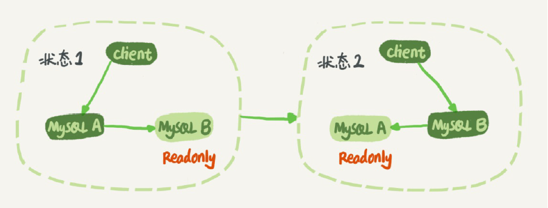
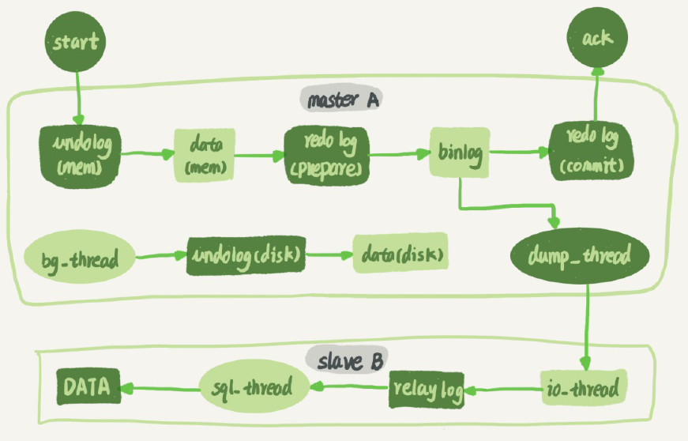
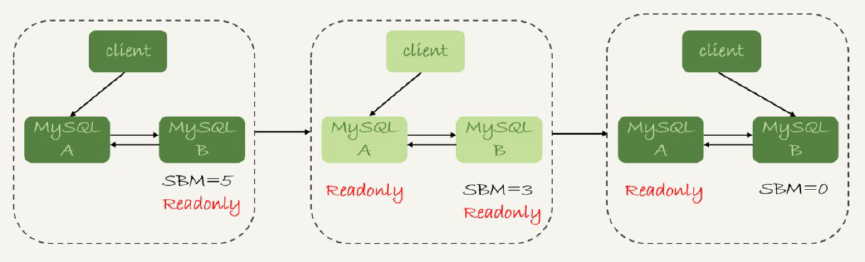

<!-- more -->

##  MySQL主从复制原理

#####   主从复制-流程

MySQL主从复制

+ MySQL master 将数据变更写入二进制日志( binary log, 其中记录叫做二进制日志事件binary log events，可以通过 show binlog events 进行查看)
+ MySQL slave 将 master 的 binary log events 拷贝到它的中继日志(relay log)
+ MySQL slave 重放 relay log 中事件，将数据变更反映它自己的数据

#####   主从复制-类型 [6]
+ 异步复制
+ 半同步复制
  MHA + 半同步复制
+ 全同步复制 
  MGR + 全同步

#####  主备切换 [1]

因为readonly设置对超级(super)权限用户是无效的，而用于同步更新的线程，就拥有超级权限。

+ 一个事务日志同步的完整过程是这样的：
1. 在备库B上通过change master命令，设置主库A的IP、端口、用户名、密码，以及要从哪个
位置开始请求binlog，这个位置包含文件名和日志偏移量。
2. 在备库B上执行start slave命令，这时候备库会启动两个线程，就是图中的io_thread和
sql_thread。其中io_thread负责与主库建立连接。
3. 主库A校验完用户名、密码后，开始按照备库B传过来的位置，从本地读取binlog，发给B。
4. 备库B拿到binlog后，写到本地文件，称为中转日志（relay log）。
5. sql_thread读取中转日志，解析出日志里的命令，并执行。

#####  Master-Master(双M)循环复制问题  [1]
+ 如果设置了双M结构，日志的执行流就会变成这样：
1. 从节点A更新的事务，binlog里面记的都是A的server id；
2. 传到节点B执行一次以后，节点B生成的binlog 的server id也是A的server id；
3. 再传回给节点A，A判断到这个server id与自己的相同，就不会再处理这个日志。所以，死循
环在这里就断掉了。

#####  主备延迟 [2]
+ 主备延迟原因
  + 备库所在机器的性能要比主库所在的**机器性能差**
  + **备库的压力大**
    解决方案: 
    I. **一主多从**。除了备库外，可以多接几个从库，让这些从库来分担读的压力。
    II. **通过binlog输出到外部系统**，比如Hadoop这类系统，让外部系统提供统计类查询的能力。
   + **大事务**
     解决方案:
     I. 不要一次性地用delete语句删除太多数据
     II. 大表DDL场景, 处理方案就是，计划内的DDL，建议使用gh-ost方案.
   + 备库的并行复制能力 [3]

#####  主备切换的策略 [2]

由于主备延迟的存在，所以在主备切换的时候，就相应的有不同的策略。

+ 可靠性优先策略 - 数据不丢、安全可靠

+ 可用性优先策略 - 服务可用

**小结：
实际的应用中，我更建议使用可靠性优先的策略。
在满足数据可靠性的前提下，MySQL高可用系统的可用性，是依赖于主备延迟的。延迟的时间越小，在主库故障的时候，服务恢复需要的时间就越短，可用性就越高。**

## 高可用方案-Master高可用[5]
##### MMM
  早期，不建议使用
##### MHA - 单主 +
  - MHA-manager 管理Master
      使用**半同步复制**
  - 缺陷： 只关注到master，对slave关注不够
##### MySQL Group Replicatoin(MGR) - 单主 [6]+
  +  **单主(荐)  多主(不推荐)** 
  +  5.7之后支持
  +   raft协议算法，自动选主节点， 自动故障转移
  +   **全同步复制**, 稳定性高, 强一致性
  -   缺陷：     
      - 不支持gap lock(间隙锁)， 隔离级别需设置为read_commited
      - 只能在GTID模式下， 并且日志格式未row格式
      - 不支持对表进行锁操作(lock/unlock table)
      - DDL语句不支持原子性
      - 最多支持9个节点
##### MySQL Cluster - 多主
  + 官方亲儿子
  + NDB engine， **存算分离**
  + 实现数据的强一致
  - 缺陷：国内使用少， 配置复杂
##### Galera Cluster - 多主 +
  + 三方提供
  + Master和数据Node部署在一起
  + WSREP协议来做数据同步
##### Percona XtraDB(PXC) -多主
  + 早期

## 高可用方案 - 数据可靠性[5]
#####  Raid10( Raid 1+0 )
##### SAN共享存储- 贵
##### DRBD磁盘复制-系统自带 + 

## MySQL Log和可靠性

  

## 容灾 [7]

## 参考

1. 《MySQL是怎么保证主备一致的？》 MySQL实战45讲  丁奇
2. 《MySQL是怎么保证高可用的？》 MySQL实战45讲 丁奇
3. 《备库为什么会延迟好几个小时？》MySQL实战45讲  丁奇
4.    xxx
5. [【IT老齐245】综合对比九种MySQL高可用方案](https://www.bilibili.com/video/BV1m44y1Q7ZF/)
6.  [【IT老齐099】哎，MySQL高可用架构选型要慎重啊！](https://www.bilibili.com/video/BV1HL411T7C8/)
7.  [腾讯云原生数据库 TDSQL-C异地容灾核心能力构建](https://zhuanlan.zhihu.com/p/451693431)  
100.  [MySQL主从复制原理剖析与应用实践](https://zhuanlan.zhihu.com/p/620697440) vivo team 未 