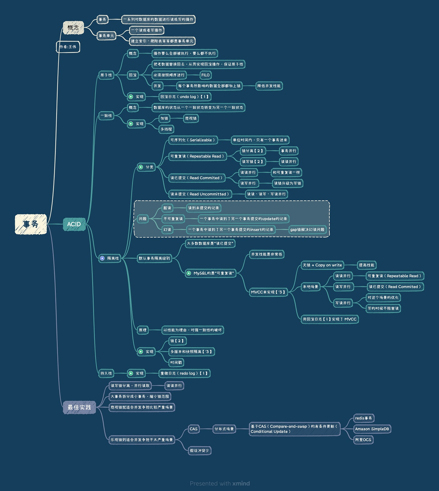

<!-- more -->

## MySQL Log和事务
  

## 参考
1. [拨开云雾见天日：剖析单机事务原理](https://dbaplus.cn/news-160-1729-1.html) CHEN川 ***
2. [多版本并发控制(MVCC)在分布式系统中的应用](https://coolshell.cn/articles/6790.html) Todd
3. 阿里云分布式缓存OCS与DB之间的数据一致性 杨成虎
4. [乐观锁和 MVCC 的区别？  ](https://www.zhihu.com/question/27876575)
5. [mysql可重复读和幻读实例  CWeeYii](https://blog.csdn.net/cweeyii/article/details/70991230)
6. [MySQL脏读、虚读、幻读 Eternity味道](https://www.cnblogs.com/lz0925/articles/8988922.html)
7. [MySQL 中事务的实现原理](https://blog.csdn.net/J_java1/article/details/82025189)  失效

