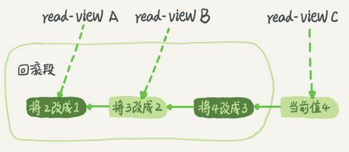

<!-- more -->

#  MyISAM vs. InnoDB

  描述  | MyISAM  |  InnoDB 
  :-: | :-: | :-: 
  行锁(并发高，会死锁)| × | √ (默认支持) Record lock: 锁记录 Gap lock: 锁范围，不锁记录 Next-key lock： 锁范围+锁记录
  表锁(并发低，不会死锁)| √ |  √
  事务和崩溃恢复| × |  √
  外键| × |  √
  MVCC| × |  √   在READ COMMITTED 和 REPEATABLE READ时有效 

#  事务隔离级别  [4]
隔离级别(从高到低)| 脏读|  不可重复读 （重点是修改）| 幻影读 （重点是新增或者删除）
:-: | :-: | :-: | :-:
SERIALIZABLE| × | × | × 
REPEATABLE-READ （**InnoDB默认隔离级别**）| × | × | √ 
READ-COMMITTED| × | √ | √ 
READ-UNCOMMITTED| √ | √ | √ 

> innodb对于行的查询使用next-key lock
  **Next-locking keying、Gap锁为了解决Phantom Problem幻读问题**
  当查询的索引含有唯一属性时(单条记录)，将next-key lock降级为record key

### 新的隔离级别
+ SI[Snapshot Isolation]
  Oracle 可串行化,  PG和MySQL称为RR
+ SSI[Serializable Snapshot Isolation]
  PostgreSQL 和 CockroachDB 已经支持 SSI

### RC和RR隔离级别 [chat]

下面是一个表格，归纳了以上文字中RC和RR隔离级别的特点：

| 隔离级别 | 快照读 #1 | 当前读 #2                  | 幻读   |
| -------- | --------- | -------------------------- | ------ |
| RC       | 不加锁    | 加锁[记录锁 是,间隙锁 否]  | 存在   |
| RR       | 不加锁    | 加锁[记录锁 是, 间隙锁 是] | 不存在 |

在RC隔离级别下，快照读和当前读都不会对记录加锁，因此不会阻塞其他事务的读操作。但是，由于RC隔离级别只对读取到的记录加锁，而不对读取的范围加锁，因此可能会出现幻读现象。幻读指的是，在一个事务中先后进行两次相同的查询操作，第二次查询会发现有新增的记录，这种现象是由于其他事务在事务中新增了这些记录所导致的。

在RR隔离级别下，快照读和当前读都不会对记录加锁，但是会对读取的范围加锁，防止其他事务在该范围内插入新的记录。因此，在RR隔离级别下不存在幻读现象。

需要注意的是，虽然RR隔离级别可以避免幻读现象，但是由于对读取范围加锁可能会导致性能问题，因此在实际应用中需要根据具体情况选择合适的隔离级别。
[ 当前读   加锁，快照读  不加锁 ]

#  MVCC 
### 原理  [2][3]

  InnoDB 中的 **RC(READ COMMITTED) 和 RR(REPEATABLE READ) 隔离事务**是基于**多版本并发控制（MVVC）**实现高性能事务。
  **MVCC 对普通的 Select 不加锁**，如果读取的数据正在执行 Delete 或 Update 操作，这时读取操作不会等待排它锁的释放，而是**直接利用 MVCC 读取该行的数据快照**（数据快照是指在该行的之前版本的数据，而数据快照的版本是基于 undo 实现的，undo 是用来做事务回滚的，记录了回滚的不同版本的行记录）。

  **MySQL默认的事务隔离级别是RR(REPEATABLE READ)**, InnoDB引擎的Select操作使用一致性非锁定读（MVCC）。 对于一致性非锁定读， 即使读取的行已经被执行了select...for update,也是可以读取的。

###  实现 
| 当前读/快照读 | 含义                                                         | 例子                                                         |
| ------------- | ------------------------------------------------------------ | ------------------------------------------------------------ |
| 当前读 #2     | 读取的是记录的最新版本，读取时还要保证其他并发事务不能修改当前记录，会对读取的记录进行加锁。 | `select ... lock in share mode`(共享锁)， `select ...for update`、 `update`、`insert`、`delete`(排他锁) |
| 快照读 #1     | 简单的select（不加锁）就是快照读，快照读，读取的是记录数据的可见版本，有可能是历史数据，不加锁，是非阻塞读。 | Read Committed：每次select，都生成一个快照读。  Repeatable Read：开启事务后第一个select语句才是快照读的地方。  Serializable：快照读会退化为当前读。 |

+ MVCC实现 [0]
  + 隐藏字段 
    DB_TRX_ID:  最近修改事务ID
    DB_ROLL_PTR: 回滚指针
    DB_ROW_ID: 隐藏主键    
  + undolog版本链 
    链表的头部是最新的旧记录，链表尾部是最早的旧记录
  + readview
    - ReadView（读视图）是 **快照读** SQL执行时MVCC提取数据的依据，记录并维护系统当前活跃的事务（未提交的）id。
    - 不同的隔离级别，生成ReadView的时机不同：
      - READ COMMITTED ：在事务中每一次执行快照读时生成ReadView。
      - REPEATABLE READ：仅在事务中第一次执行快照读时生成ReadView，后续复用该ReadView。

# 参考

0. [黑马程序员 MySQL数据库入门到精通](https://www.bilibili.com/video/BV1Kr4y1i7ru?p=78)  P141-P144
   [mysql_note](https://github.com/www6v/mysql_note) 笔记1
   [MySQL 索引](https://frxcat.fun/database/MySQL/MySQL_Advanced_index/) 笔记2 ***

1. 《深入浅出MySQL：数据库开发、优化与管理维护》 
2. 《03 | 事务隔离：为什么你改了我还看不见？ 》MySQL实战45讲  丁奇
3. 《33 | MySQL调优之事务：高并发场景下的数据库事务调优》 Java性能调优实战    刘超 deleted
4. [可能是全网最好的MySQL重要知识点](https://segmentfault.com/a/1190000019619667)  
5. 《07 | 行锁功过：怎么减少行锁对性能的影响？》 MySQL实战45讲  丁奇  deleted
6. 《18 | 为什么这些SQL语句逻辑相同性能却差异巨大？》MySQL实战45讲  丁奇
7. [MYSQL死锁的检测与预防](https://www.bilibili.com/video/BV1V3411z7Hj/)  deleted

100.    self

