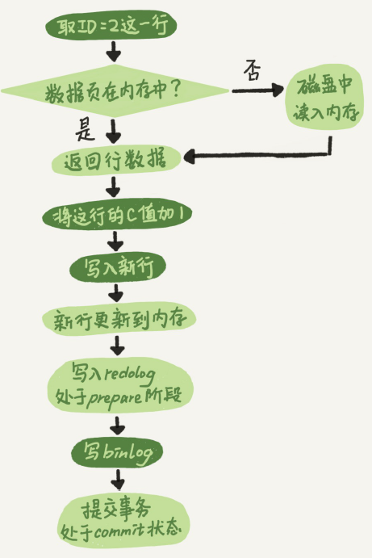

<!-- more -->

##  redo log && bin log
有了**redo log**，InnoDB就可以保证即使数据库发生异常重启，之前提交的记录都不会丢失，这个
能力称为**crash-safe**。

  \      |  redo log | bin log	   
 :-:    | :-:     | :-:      
 where	| InnoDB引擎特有的	 | MySQL的Server层实现的 
 what	| 物理日志，记录的是“在某个数据页上做了什么修改”| 逻辑日志，记录的是这个语句的原始逻辑
 how    | 循环写的|  追加写入的

##  update in Mysql
MySQL里的WAL(Write-Ahead Logging)技术，它的关键点就是**先写日志，再写磁盘.**

更新流程还涉及两个重要的日志模块，**redo log（重做日志）和 binlog（归档日志）**。

图中浅色框表示是在InnoDB内部执行的，深色框表示是在执行器中执行的。 

redo log的写入拆成了两个步骤：**prepare和commit，这就是"两阶段提交", 让redo log和bin log之间的逻辑一致**。

## 参考
1. 《MySQL实战45讲 - 日志系统：一条SQL更新语句是如何执行的？》    丁奇