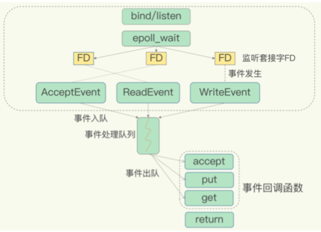
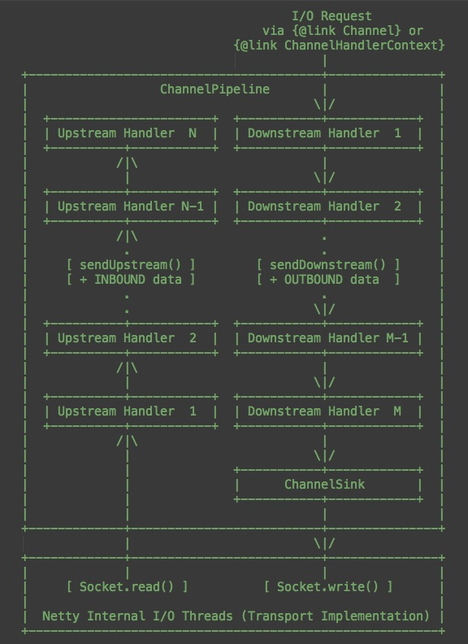

<!-- more -->

##### 关键词： 单线程，事件， socket， 多路复用

##  Redis 的IO模型
**Redis 是单线程，主要是指 Redis 的网络 IO 和键值对读写是由一个线程来完成的，这也是 Redis 对外提供键值存储服务的主要流程。**
但 Redis 的其他功能，比如持久化、异步删除、集群数据同步等，其实是由额外的线程执 行的。

##### 多路复用

                               

Linux 中的 IO 多路复用机制是指一个线程处理多个 IO 流，就是我们经常听到的 select/epoll 机制。简单来说，在 Redis 只运行单线程的情况下，**该机制允许内核中，同 时存在多个监听套接字和已连接套接字**。内核会一直监听这些套接字上的连接请求或数据 请求。一旦有请求到达，就会交给 Redis 线程处理，这就实现了一个 Redis 线程处理多个 IO 流的效果。

为了在请求到达时能通知到 Redis 线程，**select/epoll 提供了基于事件的回调机制，即针 对不同事件的发生，调用相应的处理函数**。

##### epoll的API
int epoll_create(int size); 
int epoll_ctl(int epfd, int op, int fd, struct epoll_event *event);   // 事件注册
int epoll_wait(int epfd, struct epoll_event * events, int maxevents, int timeout);  //  事件分配、事件处理

## Netty IO模型 

##### channel
channel（在socket上的通道） -  event
channel - channelPipeline（单线程）

##### reactor  
accept事件（boss线程）
read，write事件（work线程）

## 参考：
03 | 高性能IO模型:为什么单线程Redis能那么快?
[Netty源码解读（三）Channel与Pipeline](http://ifeve.com/channel-pipeline/)
https://www6v.github.io/www6vHomeHexo/2015/08/23/nettySummary/
[epoll使用详解：epoll_create、epoll_ctl、epoll_wait、close](https://www.cnblogs.com/xuewangkai/p/11158576.html)

