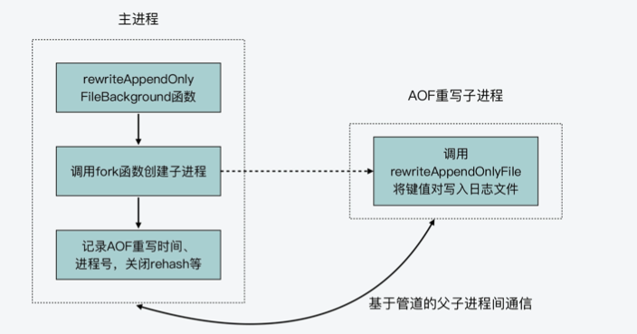

<p hidden></p>
<!-- more -->


## 一.   AOF 重写函数与触发时机
我们就了解了 AOF 重写的四个触发时机，这里我也给你总结下，方便你回 顾复习。
##### 时机一:bgrewriteaof 命令被执行。
##### 时机二:主从复制完成 RDB 文件解析和加载(无论是否成功)。
    而对于 restartAOFAfterSYNC 函数来说，它会在主从节点的复制过程中被调用。简单来 说，就是当主从节点在进行复制时，如果从节点的 AOF 选项被打开，那么在加载解析 RDB 文件时，AOF 选项就会被关闭。然后，无论从节点是否成功加载了 RDB 文件， restartAOFAfterSYNC 函数都会被调用，用来恢复被关闭的 AOF 功能。
    那么在这个过程中，restartAOFAfterSYNC 函数就会调用 startAppendOnly 函数，并进 一步调用 rewriteAppendOnlyFileBackground 函数，来执行一次 AOF 重写。
##### 时机三:AOF 重写被设置为待调度执行。
##### 时机四:AOF 被启用，同时 AOF 文件的大小比例超出阈值，以及 AOF 文件的大小绝对 值超出阈值。
auto-aof-rewrite-percentage:AOF 文件大小超出基础大小的比例，默认值为 100%，即超出 1 倍大小。
auto-aof-rewrite-min-size:AOF 文件大小绝对值的最小值，默认为 64MB。

另外，这里你还需要注意，在这四个时机下，其实都不能有正在执行的 RDB 子进程和 AOF 重写子进程，否则的话，AOF 重写就无法执行了。


## 二.  AOF 重写的基本过程

```c
int rewriteAppendOnlyFileBackground(void) {
    ...
	if ((childpid = fork()) == 0) { //创建子进程 
         ...
		//子进程调用rewriteAppendOnlyFile进行AOF重写
		if (rewriteAppendOnlyFile(tmpfile) == C_OK) {
            size_t private_dirty = zmalloc_get_private_dirty(-1);
            ...
            exitFromChild(0);
        } else {
            exitFromChild(1);
		} 
	}
	else{ //父进程执行的逻辑 
        ...
		server.aof_rewrite_scheduled = 0; 
		server.aof_rewrite_time_start = time(NULL); 
		server.aof_child_pid = childpid; //记录重写子进程的进程号 
		updateDictResizePolicy(); //关闭rehash功能
        ... 
    }
}
```




不过，AOF 重写和 RDB 文件又有两个不同的地方:
一是，AOF 文件中是以“命令 + 键值对”的形式，来记录每个键值对的插入操作，而 RDB 文件记录的是键值对数据本身;
二是，在 AOF 重写或是创建 RDB 的过程中，主进程仍然可以接收客户端写请求。不 过，因为 RDB 文件只需要记录某个时刻下数据库的所有数据就行，而 AOF 重写则需要 尽可能地把主进程收到的写操作，也记录到重写的日志文件中。所以，AOF 重写子进程 就需要有相应的机制来和主进程进行通信，以此来接收主进程收到的写操作。

