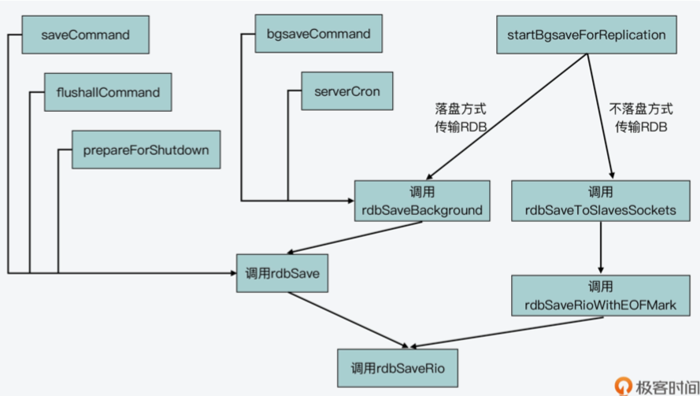

<p hidden></p>
<!-- more -->


```c
/// 对应了 Redis 的 save 命 令，会在 save 命令的实现函数 saveCommand(在 rdb.c 文件中)中被调用
/* Save the DB on disk. Return C_ERR on error, C_OK on success. */
int rdbSave(char *filename, rdbSaveInfo *rsi) {
    char tmpfile[256];
    char cwd[MAXPATHLEN]; /* Current working dir path for error messages. */
    FILE *fp;
    rio rdb;
    int error = 0;

    snprintf(tmpfile,256,"temp-%d.rdb", (int) getpid());
    fp = fopen(tmpfile,"w");
    if (!fp) {
        char *cwdp = getcwd(cwd,MAXPATHLEN);
        serverLog(LL_WARNING,
            "Failed opening the RDB file %s (in server root dir %s) "
            "for saving: %s",
            filename,
            cwdp ? cwdp : "unknown",
            strerror(errno));
        return C_ERR;
    }

    rioInitWithFile(&rdb,fp);

    if (server.rdb_save_incremental_fsync)
        rioSetAutoSync(&rdb,REDIS_AUTOSYNC_BYTES);

    if (rdbSaveRio(&rdb,&error,RDB_SAVE_NONE,rsi) == C_ERR) {. /// 调用 rdbSaveRio 函数(在 rdb.c 文件中)来实际创建 RDB 文件
        errno = error;
        goto werr;
    }

    /* Make sure data will not remain on the OS's output buffers */
    if (fflush(fp) == EOF) goto werr;
    if (fsync(fileno(fp)) == -1) goto werr;
    if (fclose(fp) == EOF) goto werr;

    /* Use RENAME to make sure the DB file is changed atomically only
     * if the generate DB file is ok. */
    if (rename(tmpfile,filename) == -1) {
        char *cwdp = getcwd(cwd,MAXPATHLEN);
        serverLog(LL_WARNING,
            "Error moving temp DB file %s on the final "
            "destination %s (in server root dir %s): %s",
            tmpfile,
            filename,
            cwdp ? cwdp : "unknown",
            strerror(errno));
        unlink(tmpfile);
        return C_ERR;
    }

    serverLog(LL_NOTICE,"DB saved on disk");
    server.dirty = 0;
    server.lastsave = time(NULL);
    server.lastbgsave_status = C_OK;
    return C_OK;

werr:
    serverLog(LL_WARNING,"Write error saving DB on disk: %s", strerror(errno));
    fclose(fp);
    unlink(tmpfile);
    return C_ERR;
}
```


```c
/// 对应 了 Redis 的 bgsave 命令，会在 bgsave 命令的实现函数 bgsaveCommand(在 rdb.c 文 件中)中被调用
int rdbSaveBackground(char *filename, rdbSaveInfo *rsi) {
    pid_t childpid;
    long long start;

    if (server.aof_child_pid != -1 || server.rdb_child_pid != -1) return C_ERR;

    server.dirty_before_bgsave = server.dirty;
    server.lastbgsave_try = time(NULL);
    openChildInfoPipe();

    start = ustime();
    if ((childpid = fork()) == 0) {  /// 子进程的代码执行分支
        int retval;

        /* Child */
        closeClildUnusedResourceAfterFork();
        redisSetProcTitle("redis-rdb-bgsave");
        retval = rdbSave(filename,rsi);   ///  调用rdbSave函数创建RDB文件
        if (retval == C_OK) {
            size_t private_dirty = zmalloc_get_private_dirty(-1);

            if (private_dirty) {
                serverLog(LL_NOTICE,
                    "RDB: %zu MB of memory used by copy-on-write",
                    private_dirty/(1024*1024));
            }

            server.child_info_data.cow_size = private_dirty;
            sendChildInfo(CHILD_INFO_TYPE_RDB);
        }
        exitFromChild((retval == C_OK) ? 0 : 1);   ///  子进程退出
    } else {  
        /* Parent */    //父进程代码执行分支
        server.stat_fork_time = ustime()-start;
        server.stat_fork_rate = (double) zmalloc_used_memory() * 1000000 / server.stat_fork_time / (1024*1024*1024); /* GB per second. */
        latencyAddSampleIfNeeded("fork",server.stat_fork_time/1000);
        if (childpid == -1) {
            closeChildInfoPipe();
            server.lastbgsave_status = C_ERR;
            serverLog(LL_WARNING,"Can't save in background: fork: %s",
                strerror(errno));
            return C_ERR;
        }
        serverLog(LL_NOTICE,"Background saving started by pid %d",childpid);
        server.rdb_save_time_start = time(NULL);
        server.rdb_child_pid = childpid;
        server.rdb_child_type = RDB_CHILD_TYPE_DISK;
        updateDictResizePolicy();
        return C_OK;
    }
    return C_OK; /* unreached */
}
```


```c
/// 这是 Redis server 在采用不落盘方式传输 RDB 文件进行主从复制时，创建 RDB 文件的入 口函数
/// rdbSaveToSlavesSockets 函数是通过网络以字节流的形式，直接发送 RDB 文件的二进制 数据给从节点。
/* Spawn an RDB child that writes the RDB to the sockets of the slaves
 * that are currently in SLAVE_STATE_WAIT_BGSAVE_START state. */
int rdbSaveToSlavesSockets(rdbSaveInfo *rsi) {
    int *fds;
    uint64_t *clientids;
    int numfds;
    listNode *ln;
    listIter li;
    pid_t childpid;
    long long start;
    int pipefds[2];

    if (server.aof_child_pid != -1 || server.rdb_child_pid != -1) return C_ERR;

    /* Before to fork, create a pipe that will be used in order to
     * send back to the parent the IDs of the slaves that successfully
     * received all the writes. */
    if (pipe(pipefds) == -1) return C_ERR;
    server.rdb_pipe_read_result_from_child = pipefds[0];
    server.rdb_pipe_write_result_to_parent = pipefds[1];

    /* Collect the file descriptors of the slaves we want to transfer
     * the RDB to, which are i WAIT_BGSAVE_START state. */
    fds = zmalloc(sizeof(int)*listLength(server.slaves));
    /* We also allocate an array of corresponding client IDs. This will
     * be useful for the child process in order to build the report
     * (sent via unix pipe) that will be sent to the parent. */
    clientids = zmalloc(sizeof(uint64_t)*listLength(server.slaves));
    numfds = 0;

    listRewind(server.slaves,&li);
    while((ln = listNext(&li))) {
        client *slave = ln->value;

        if (slave->replstate == SLAVE_STATE_WAIT_BGSAVE_START) {
            clientids[numfds] = slave->id;
            fds[numfds++] = slave->fd;
            replicationSetupSlaveForFullResync(slave,getPsyncInitialOffset());
            /* Put the socket in blocking mode to simplify RDB transfer.
             * We'll restore it when the children returns (since duped socket
             * will share the O_NONBLOCK attribute with the parent). */
            anetBlock(NULL,slave->fd);
            anetSendTimeout(NULL,slave->fd,server.repl_timeout*1000);
        }
    }

    /* Create the child process. */
    openChildInfoPipe();
    start = ustime();
    if ((childpid = fork()) == 0) {
        /* Child */
        int retval;
        rio slave_sockets;

        rioInitWithFdset(&slave_sockets,fds,numfds);
        zfree(fds);

        closeClildUnusedResourceAfterFork();
        redisSetProcTitle("redis-rdb-to-slaves");

        retval = rdbSaveRioWithEOFMark(&slave_sockets,NULL,rsi);
        if (retval == C_OK && rioFlush(&slave_sockets) == 0)
            retval = C_ERR;

        if (retval == C_OK) {
            size_t private_dirty = zmalloc_get_private_dirty(-1);

            if (private_dirty) {
                serverLog(LL_NOTICE,
                    "RDB: %zu MB of memory used by copy-on-write",
                    private_dirty/(1024*1024));
            }

            server.child_info_data.cow_size = private_dirty;
            sendChildInfo(CHILD_INFO_TYPE_RDB);

            /* If we are returning OK, at least one slave was served
             * with the RDB file as expected, so we need to send a report
             * to the parent via the pipe. The format of the message is:
             *
             * <len> <slave[0].id> <slave[0].error> ...
             *
             * len, slave IDs, and slave errors, are all uint64_t integers,
             * so basically the reply is composed of 64 bits for the len field
             * plus 2 additional 64 bit integers for each entry, for a total
             * of 'len' entries.
             *
             * The 'id' represents the slave's client ID, so that the master
             * can match the report with a specific slave, and 'error' is
             * set to 0 if the replication process terminated with a success
             * or the error code if an error occurred. */
            void *msg = zmalloc(sizeof(uint64_t)*(1+2*numfds));
            uint64_t *len = msg;
            uint64_t *ids = len+1;
            int j, msglen;

            *len = numfds;
            for (j = 0; j < numfds; j++) {
                *ids++ = clientids[j];
                *ids++ = slave_sockets.io.fdset.state[j];
            }

            /* Write the message to the parent. If we have no good slaves or
             * we are unable to transfer the message to the parent, we exit
             * with an error so that the parent will abort the replication
             * process with all the childre that were waiting. */
            msglen = sizeof(uint64_t)*(1+2*numfds);
            if (*len == 0 ||
                write(server.rdb_pipe_write_result_to_parent,msg,msglen)
                != msglen)
            {
                retval = C_ERR;
            }
            zfree(msg);
        }
        zfree(clientids);
        rioFreeFdset(&slave_sockets);
        exitFromChild((retval == C_OK) ? 0 : 1);
    } else {
        /* Parent */
        if (childpid == -1) {
            serverLog(LL_WARNING,"Can't save in background: fork: %s",
                strerror(errno));

            /* Undo the state change. The caller will perform cleanup on
             * all the slaves in BGSAVE_START state, but an early call to
             * replicationSetupSlaveForFullResync() turned it into BGSAVE_END */
            listRewind(server.slaves,&li);
            while((ln = listNext(&li))) {
                client *slave = ln->value;
                int j;

                for (j = 0; j < numfds; j++) {
                    if (slave->id == clientids[j]) {
                        slave->replstate = SLAVE_STATE_WAIT_BGSAVE_START;
                        break;
                    }
                }
            }
            close(pipefds[0]);
            close(pipefds[1]);
            closeChildInfoPipe();
        } else {
            server.stat_fork_time = ustime()-start;
            server.stat_fork_rate = (double) zmalloc_used_memory() * 1000000 / server.stat_fork_time / (1024*1024*1024); /* GB per second. */
            latencyAddSampleIfNeeded("fork",server.stat_fork_time/1000);

            serverLog(LL_NOTICE,"Background RDB transfer started by pid %d",
                childpid);
            server.rdb_save_time_start = time(NULL);
            server.rdb_child_pid = childpid;
            server.rdb_child_type = RDB_CHILD_TYPE_SOCKET;
            updateDictResizePolicy();
        }
        zfree(clientids);
        zfree(fds);
        return (childpid == -1) ? C_ERR : C_OK;
    }
    return C_OK; /* Unreached. */
}
```




## 参考：
18 | 如何生成和解读RDB文件?  
《Redis源码剖析与实战》


