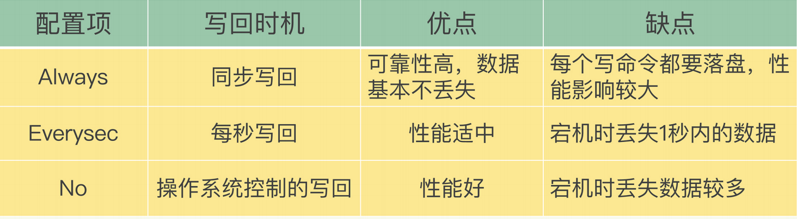
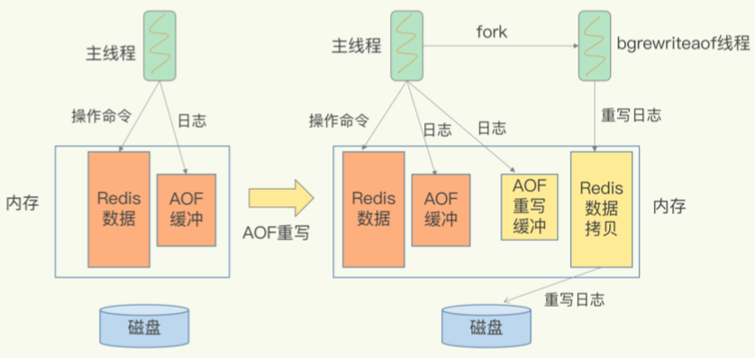

<!-- more -->

                                    
#  AOF 

### 定义[1]
+ [AOF不是WAL，是先操作，后记录日志。]
+ 传统数据库的日志，例如 redo log(重做日志)，记录的是修改后的数据，而AOF里记录的是Redis收到的每一条命令，这些命令是以文本形式保存的。

+ **AOF 日志**正好相反，它是**写后日志**，“写后”的意思是 Redis 是先执行命令，把数据写入内存，然后才记录日志。
+ 而写后日志这种方式，就是先让系统执行命令，只有命令能执行成功，才会被记录到日志中，否则，系统就会直接向客户端报错。
所以，Redis 使用写后日志这一方式的一大好处是，可以避免出现记录错误命令的情况。
+ AOF 还有一个好处：它是在命令执行后才记录日志，所以**不会阻塞当前的写操作**。

**AOF 是 写前日志**

### 两个潜在的风险 [1]
1. 如果刚执行完一个命令，还没有来得及记日志就宕机了，那么这个命令和相应的数 据就有丢失的风险.
2. AOF 日志也是在主线程中执行的，如果在把日志文件写入磁盘时，磁盘写压力大，就 会导致写盘很慢，进而导致后续的操作也无法执行了.

###  三种写回策略 [1] 
+ AOF 配置项  -  appendfsync 的三个可选值
  - **Always**，同步写回：每个写命令执行完，**立马同步地将日志写回磁盘**；
  - **Everysec**，每秒写回：每个写命令执行完，只是先把日志写到 AOF 文件的内存缓冲区，**每隔一秒把缓冲区中的内容写入磁盘**；
  - **No**，操作系统控制的写回：每个写命令执行完，只是先把日志写到 AOF 文件的内存缓冲区，由操作系统决定何时将缓冲区内容写回磁盘。

### 关闭AOF落盘 [2]
AOF落盘会带来一定写性能损耗，如果将Redis实例应用于纯缓存场景中，对数据持久化没有需求，您可以按照本章节的说明，修改appendonly参数的值，关闭AOF落盘。

#  AOF Rewrite过程
+ 功能
  压缩AOF文件的大小
  
+ AOF Rewrite过程 [1]
  非阻塞的重写

+ 一个拷贝，两处日志 [1]

+ 触发机制 [4]
  + 手动触发
    bgrewriteaof 命令
  + 自动触发
    AOF文件大小
    
# 参考
1. 《04 | AOF日志:宕机了，Redis如何避免数据丢失? 》    蒋德钧
2. [关闭AOF落盘](https://help.aliyun.com/knowledge_detail/147408.html?spm=a2c4g.11186623.2.2.7e373f2e7XKCDO)
3. 
4. 《Redis开发与运维》  第5章

