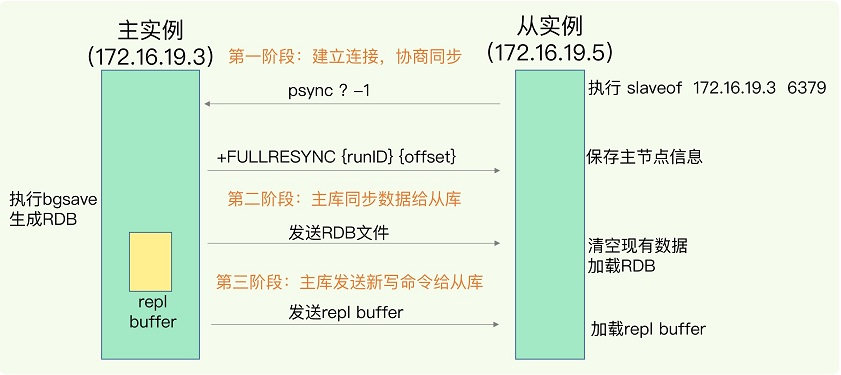
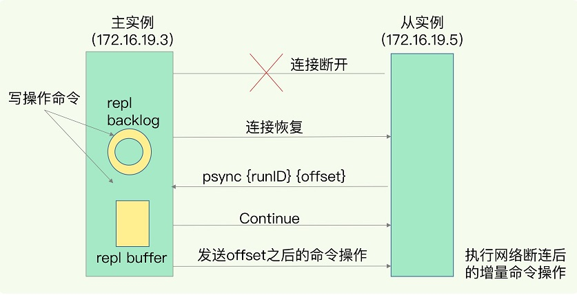

<!-- more -->

# 主从复制流程
###  主从库第一次同步的流程

   

### 主从库增量复制流程
                          

repl_backlog_buffer 是一个环形缓冲区，**主库会记录自己写到的位置，从库则会记录自己 已经读到的位置**。

# 缺点 [3]
+ 主从延迟
  - 复制偏移量：master_repl_offset | slave_repl_offset
+ master挂了怎么办？
  - 默认情况下，不会在slave节点中自动选一个master
  - 每次都要人工干预
    **需要Redis哨兵(sentinel)**

# 参考
1. 《06 | 数据同步：主从库如何实现数据一致？》
2. [**redis主从复制、主从延迟知几何**](https://www.cnblogs.com/niejunlei/p/12904984.html)
3. [复制原理和工作流程](https://github.com/www6v/Learning-in-practice/blob/master/Redis/8.Redis%E5%A4%8D%E5%88%B6(replica)/4.%E5%A4%8D%E5%88%B6%E5%8E%9F%E7%90%86%E5%92%8C%E5%B7%A5%E4%BD%9C%E6%B5%81%E7%A8%8B.md)
   [61_redis主从复制之工作流程总结](https://www.bilibili.com/video/BV13R4y1v7sP?p=61) V
   [62_redis主从复制之痛点和改进需求](https://www.bilibili.com/video/BV13R4y1v7sP?p=62) V