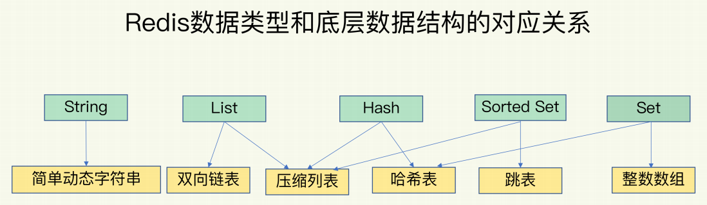
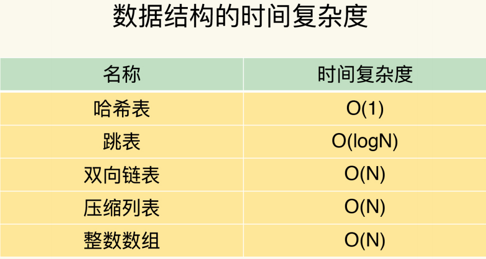
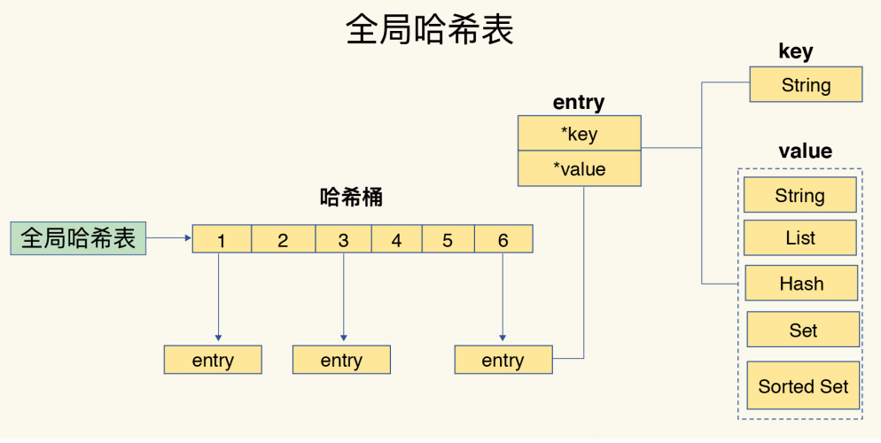

<!-- more -->

## 数据结构和实现

---

 数据结构	  | 基础	  |  优化  | 特点   
 :-: | :-:     | :-:  |  :-:
 String	| SDS| |
 List | 双向列表 | 压缩列表 |
 Hash | hash表  | 压缩列表 |  渐进式rehash
 SortedSet | 跳表 | 压缩列表 |
 Set | 整数数组 | |

---

## 全局hash表 && 渐进式 rehash

## 参考：
02 | 数据结构:快速的Redis有哪些慢操作?