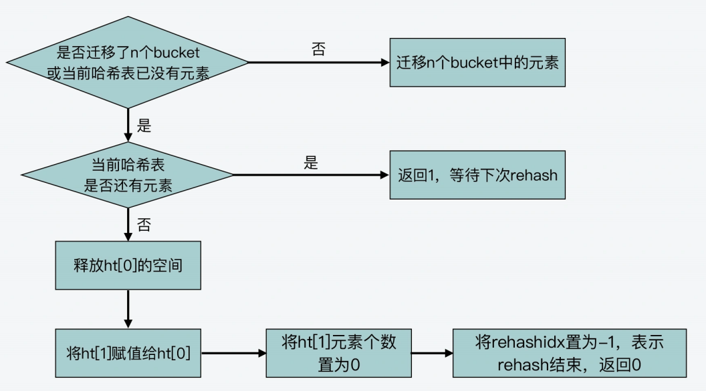

<!-- more -->

### 什么时候触发 rehash？
，_dictExpandIfNeeded 函数中定义了三个扩容条件。
下面的代码就展示了 _dictExpandIfNeeded 函数对这三个条件的定义，你可以看下。
条件一：ht[0]的大小为 0。
条件二：ht[0]承载的元素个数已经超过了 ht[0]的大小，同时 Hash 表可以进行扩容。
条件三：ht[0]承载的元素个数，是 ht[0]的大小的 dict_force_resize_ratio 倍，其中，
**dict_force_resize_ratio 的默认值是 5**。

### rehash 扩容扩多大？
对 Hash表扩容的思路也很简单，就是如果当前表的已用空间大小为 size，**那么就将表扩容到** size*2 **的大小**。

### rehash 如何执行？
其实这是因为，Hash 表在执行 rehash 时，由于 Hash 表空间扩大，原本映射到某一位置
的键可能会被映射到一个新的位置上，因此，很多键就需要从原来的位置拷贝到新的位
置。**而在键拷贝时，由于 Redis 主线程无法执行其他请求，所以键拷贝会阻塞主线程，这
样就会产生 rehash 开销。**

**而为了降低 rehash 开销，Redis 就提出了渐进式 rehash 的方法。**

### dictRehash 的主要执行流程
