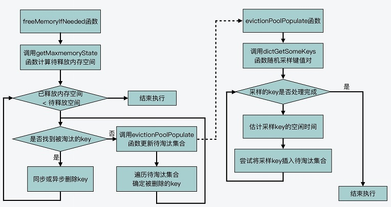

<p></p>
<!-- more -->


#  LRU 算法的实现
Redis 对近似 LRU 算法的实现分成了三个部分

###  全局 LRU 时钟值的计算

这部分包括，Redis 源码为了实现近似 LRU 算法的效果，是
如何计算全局 LRU 时钟值的，以用来判断数据访问的时效性；

1. **全局 LRU 时钟值就是通过 getLRUClock 函数计算得到的**。
2. **如果一个数据前后两次访问的时间间隔小于 1 秒，那么这 两次访问的时间戳就是一样的**。
3. serverCron 函数作为时间事件的回调函数，本身会按照一定的频率周期性执行，其频率值
是由 Redis 配置文件 redis.conf 中的 **hz 配置项**决定的。hz 配置项的默认值是 10，这表
示 serverCron 函数会每 100 毫秒（1 秒 /10 = 100 毫秒）运行一次。

这样，在 serverCron 函数中，全局 LRU 时钟值就会按照这个函数的执行频率，定期调用
getLRUClock 函数进行更新，如下所示：

``` C 
int serverCron(struct aeEventLoop *eventLoop, long long id, void *clientData) 
... 
unsigned long lruclock = getLRUClock(); //默认情况下，每100毫秒调用getLRUClock函数更
atomicSet(server.lruclock,lruclock); //设置lruclock变量
... 
}
```

``` 
#hz默认设为10，提高它的值将会占用更多的cpu，当然相应的redis将会更快的处理同时到期的许多key，以及更精确的去处理超时。
#hz的取值范围是1~500，通常不建议超过100，只有在请求延时非常低的情况下可以将值提升到100。
hz 10
```

###  键值对 LRU 时钟值的初始化与更新
这部分包括，Redis 源码在哪些函数中对每个键值对对应的 LRU 时钟值，进行初始化与更新；


###  近似 LRU 算法的实际执行
这部分包括，Redis 源码具体如何执行近似 LRU 算法，也就是何时触发数据淘汰，以及实际淘汰的机制是怎么实现的。
  1. 何时触发算法执行？
  2. 算法具体如何执行？




# 参考
《15 | 为什么LRU算法原理和代码实现不一样？》  


