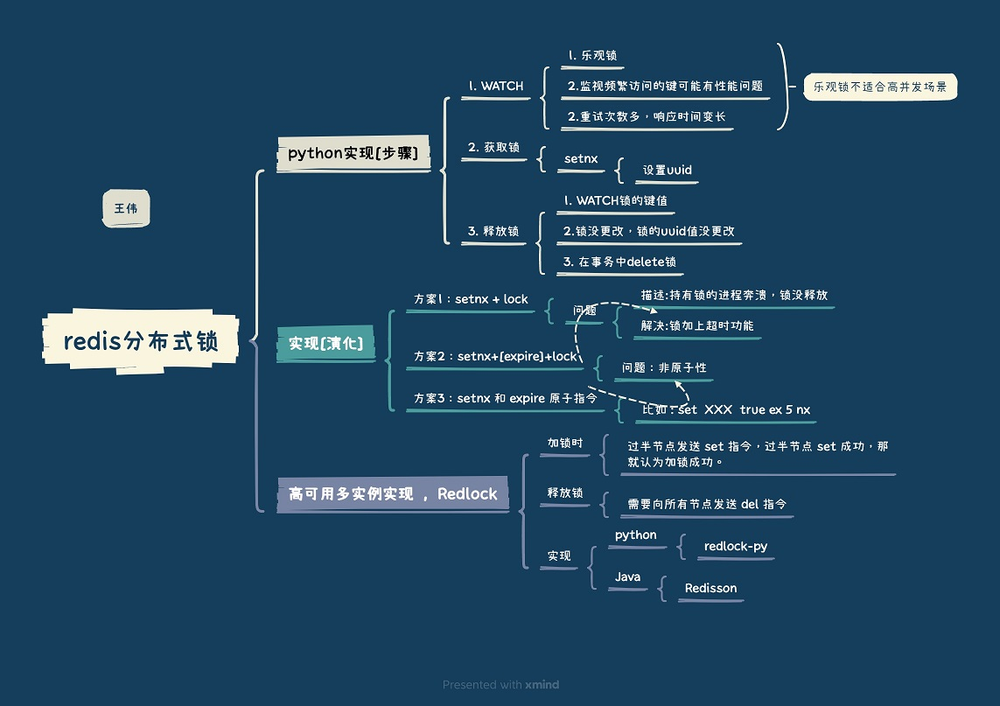

<!-- more -->

## 一. 基于redis的分布式锁  

## 锁的特性:   

1. 排它性
2. 超时释放锁
   redis expire
3. 高可用，锁集群容错[图2]，
   安全性[7]，
4. 可重入锁, 避免死锁[8]
5. 乐观锁, 悲观锁[10][图2]

## 参考：

1. [分布式系统互斥性与幂等性问题的分析与解决](https://tech.meituan.com/2016/09/29/distributed-system-mutually-exclusive-idempotence-cerberus-gtis.html) 点评 蒋谞 
2. 漫画：什么是分布式锁？ 程序员小灰
3. 《从Paxos到Zookeeper分布式一致性原理与实践》 倪超 6.1.7节
4. Redlock：Redis分布式锁最牛逼的实现 阿飞的博客
5. [SOFAJRaft-RheaKV 分布式锁实现剖析 | SOFAJRaft 实现原理](https://mp.weixin.qq.com/s/ahcbgxWVVmRwrH9Y4-gXBA)   SOFALab 米麒麟 未
6. [Go to Page](redis.md)  self

---
7. [分布式服务总结 分布式锁](https://www.jianshu.com/p/31e85a18a9e7)  
   通过栅栏(fencing)使得锁更安全, fencing token
   [How to do distributed locking](http://martin.kleppmann.com/2016/02/08/how-to-do-distributed-locking.html) Martin Kleppmann  
8. [Redis实现分布式锁，以及可重入锁思路](https://www.jianshu.com/p/1c5c1a592088)   
   唯一id I. uuid  II. 分布式线程中标识唯一线程：MAC地址 + jvm进程ID + 线程ID  
10. [Redis分布式锁实现秒杀业务(乐观锁、悲观锁)](https://www.cnblogs.com/jasonZh/p/9522772.html)  最后
    乐观锁: jedis的watch方法

---
from redis
《Redis 深度历险：核心原理与应用实践》 钱文品
3. 应用 1：千帆竞发 —— 分布式锁
4. 拓展 3：拾遗漏补 —— 再谈分布式锁

