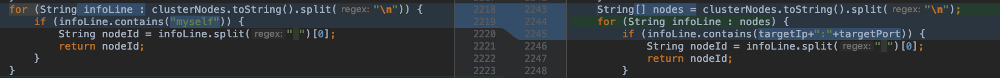

<p></p>
<!-- more -->


# 1. 背景
有一次扩容 Redis 集群，往集群加入节点，这个操作了很多次的功能居然失败了。查看到异常日志：addAppClusterSharding:10.3.28.7:10240:10.3.28.70, result is false  
观察发现，Redis实例已启动，并且加入到集群，但是主从角色不正确  
本地调试发现，在从节点执行cluster replicate <master_node_id>报错，提示***，发现命令的<master_node_id>和Redis实例的<node_id>不一致  
- Redis node_id是如何生成的，怎么会变化呢？

临时查看最近修改代码，
com.tuhu.renault.portal.redis.impl.RedisCenterImpl  getNodeId方法 
原来：  
从目标Redis实例获取自己的node_id  
改成了：  
可以从其他Redis实例获取（因为cluster nodes命令可以拿到集群所有节点信息）  
原因是：  
当目标节点挂了，会获取不到node_id，页面操作故障节点下线会失败（用于下线故障节点）  
修复方法：  
临时恢复从目标实例获取自己的node_id;下线故障节点时候从其他节点获取node_id  



下文简单梳理 Redis 集群扩容过程，主要关注 Redis node_id 变化及相关源码。

# 2. Redis集群扩容过程梳理
Renault管理平台入口：  
- com.tuhu.renault.portal.controller.ClusterController   doAddHorizontalNodes 方法  
主要包括三个步骤：（1）启动 Redis 实例；（2）meet Redis 实例；（3）确定主从角色。  

### 2.1 启动Redis实例
+ 根据模板生成Redis配置文件，并拷贝到目标机器
+ 执行：redis-server /usr/local/renault/conf/redis-cluster-6379.conf
+ 没有返回值，检测端口被占用则认为成功


### 2.2 Redis集群所有主节点meet待加入节点
+ 确定Redis实例为"单身"
+ 执行：cluster meet <ip> <port>，https://redis.io/commands/cluster-meet
+ 返回“OK”即成功

### 2.3 确定主从角色
+ 获取主节点NodeId
+ 从节点实例执行：cluster replicate <node_id>，https://redis.io/commands/cluster-replicate
+ 返回“OK”即成功

#  3. Redis集群扩容期间节点状态
### 3.1 扩容前集群节点状态
``` Shell
root@work-arch-renault-redis-3 (16:06:02) ~ # redis-cli -p 6436 cluster nodes
798f8791b4e302df6c5e1418466e91899e199546 10.100.140.229:6436@16436 master - 0 1642579573335 66 connected 0-5454
68eab9a2f3bae16afd41ae43970f866c01bebcf0 10.100.140.231:6436@16436 myself,master - 0 1642579573000 69 connected 5455-10923
9a1be71bd5699ecb62b4308212ba1363ea72020f 10.100.140.233:6435@16435 master - 0 1642579575338 67 connected 10924-16383
86107b968a281aedbcddd9267b53dfb4bcaadee4 10.100.140.230:6437@16437 slave 798f8791b4e302df6c5e1418466e91899e199546 0 1642579574337 66 connected
ba7481602474ce44fa964af043c9417670246002 10.100.140.232:6437@16437 slave 68eab9a2f3bae16afd41ae43970f866c01bebcf0 0 1642579573000 69 connected
ad0cc373957d84ba9e37114feee68a8414408bf6 10.100.140.234:6436@16436 slave 9a1be71bd5699ecb62b4308212ba1363ea72020f 0 1642579572335 67 connected
```
每行的组成结构：```<id> <ip:port> <flags> <master> <ping-sent> <pong-recv> <config-epoch> <link-state> <slot> <slot> ... <slot>```
每项的含义如下:
+ 1.id: 节点ID
+ 2.ip:port：客户端与节点通信使用的地址
+ 3.flags：逗号分割的标记位，可能的值如下 
   - a. myself：当前连接的节点
   - b. master：节点是master
   - c. slave：节点是slave
   - d. fail?：节点处于PFAIL 状态。 当前节点无法联系，但逻辑上是可达的 (非 FAIL 状态)
   - e. fail：节点处于FAIL 状态. 大部分节点都无法与其取得联系将会将改节点由 PFAIL 状态升级至FAIL状态
   - f. handshake：还未取得信任的节点，当前正在与其进行握手
   - g. noaddr：没有地址的节点
   - h. noflags：连个标记都没有
+ 4. master_id：如果节点是slave，并且已知master节点，则这里列出master节点ID,否则的话这里列出”-“
+ 5. ping-sent：最近一次发送ping的时间，这个时间是一个unix毫秒时间戳，0代表没有发送过
+ 6. pong-recv：最近一次收到pong的时间，使用unix时间戳表示
+ 7. config-epoch：节点的epoch值（从节点值随主节点）
  - a. 每当节点发生失败切换时，都会创建一个新的，独特的，递增的epoch
  - b. 如果多个节点竞争同一个哈希槽时，epoch值更高的节点会抢夺到
+ 8. link-state：node-to-node集群总线使用的链接的状态，我们使用这个链接与集群中其他节点进行通信
  - a. 值可以是 connected 和 disconnected
+ 9. slot：哈希槽值或者一个哈希槽范围，代表当前节点可以提供服务的哈希槽值


### 3.2 Redis启动后“单身”状态
``` Shell
root@work-arch-docker-3 (16:14:17) ~ # redis-cli -p 6379 cluster nodes
77199f3d3b63360117c352f51f0262627a53d215 :6379@16379 myself,master - 0 0 0 connected
root@work-arch-docker-3 (16:14:30) ~ #
root@work-arch-docker-3 (16:14:30) ~ # redis-cli -p 6380 cluster nodes
60445f6231213b2285f216eac53f67408bdeae28 :6380@16380 myself,master - 0 0 0 connected
```

### 3.3 Meet Redis实例1
```  Shell
root@work-arch-docker-3 (16:15:16) ~ # redis-cli -p 6379 cluster nodes
ba7481602474ce44fa964af043c9417670246002 10.100.140.232:6437@16437 slave 68eab9a2f3bae16afd41ae43970f866c01bebcf0 0 1642580117000 69 connected
86107b968a281aedbcddd9267b53dfb4bcaadee4 10.100.140.230:6437@16437 slave 798f8791b4e302df6c5e1418466e91899e199546 0 1642580117750 66 connected
ad0cc373957d84ba9e37114feee68a8414408bf6 10.100.140.234:6436@16436 slave 9a1be71bd5699ecb62b4308212ba1363ea72020f 0 1642580115000 67 connected
798f8791b4e302df6c5e1418466e91899e199546 10.100.140.229:6436@16436 master - 0 1642580115742 66 connected 0-5454
68eab9a2f3bae16afd41ae43970f866c01bebcf0 10.100.140.231:6436@16436 master - 0 1642580115000 69 connected 5455-10923
9a1be71bd5699ecb62b4308212ba1363ea72020f 10.100.140.233:6435@16435 master - 0 1642580117000 67 connected 10924-16383
77199f3d3b63360117c352f51f0262627a53d215 10.100.140.152:6379@16379 myself,master - 0 1642580115000 0 connected
```

### 3.4 Meet Redis实例2
``` Shell
root@work-arch-docker-3 (16:15:22) ~ # redis-cli -p 6380 cluster nodes
86107b968a281aedbcddd9267b53dfb4bcaadee4 10.100.140.230:6437@16437 slave 798f8791b4e302df6c5e1418466e91899e199546 0 1642580129887 66 connected
ba7481602474ce44fa964af043c9417670246002 10.100.140.232:6437@16437 slave 68eab9a2f3bae16afd41ae43970f866c01bebcf0 0 1642580132000 69 connected
ad0cc373957d84ba9e37114feee68a8414408bf6 10.100.140.234:6436@16436 slave 9a1be71bd5699ecb62b4308212ba1363ea72020f 0 1642580130000 67 connected
798f8791b4e302df6c5e1418466e91899e199546 10.100.140.229:6436@16436 master - 0 1642580130590 66 connected 0-5454
68eab9a2f3bae16afd41ae43970f866c01bebcf0 10.100.140.231:6436@16436 master - 0 1642580133595 69 connected 5455-10923
9a1be71bd5699ecb62b4308212ba1363ea72020f 10.100.140.233:6435@16435 master - 0 1642580132593 67 connected 10924-16383
77199f3d3b63360117c352f51f0262627a53d215 10.100.140.152:6379@16379 master - 0 1642580131592 0 connected
60445f6231213b2285f216eac53f67408bdeae28 10.100.140.152:6380@16380 myself,master - 0 1642580133000 73 connected
```

### 3.5 指定新增实例主从关系
``` Shell
root@work-arch-docker-3 (16:16:55) ~ # redis-cli -p 6379 cluster nodes
ba7481602474ce44fa964af043c9417670246002 10.100.140.232:6437@16437 slave 68eab9a2f3bae16afd41ae43970f866c01bebcf0 0 1642580214980 69 connected
86107b968a281aedbcddd9267b53dfb4bcaadee4 10.100.140.230:6437@16437 slave 798f8791b4e302df6c5e1418466e91899e199546 0 1642580215985 66 connected
60445f6231213b2285f216eac53f67408bdeae28 10.100.140.152:6380@16380 slave 77199f3d3b63360117c352f51f0262627a53d215 0 1642580213000 73 connected
ad0cc373957d84ba9e37114feee68a8414408bf6 10.100.140.234:6436@16436 slave 9a1be71bd5699ecb62b4308212ba1363ea72020f 0 1642580212000 67 connected
798f8791b4e302df6c5e1418466e91899e199546 10.100.140.229:6436@16436 master - 0 1642580212000 66 connected 0-5454
68eab9a2f3bae16afd41ae43970f866c01bebcf0 10.100.140.231:6436@16436 master - 0 1642580213578 69 connected 5455-10923
9a1be71bd5699ecb62b4308212ba1363ea72020f 10.100.140.233:6435@16435 master - 0 1642580214000 67 connected 10924-16383
77199f3d3b63360117c352f51f0262627a53d215 10.100.140.152:6379@16379 myself,master - 0 1642580214000 0 connected
```

#  5. 延伸阅读
### 5.1 Redis 集群数据结构
初始化 cluster 中有三个重要数据结构：
- clusterState：记录当前节点视角下，集群目前的状态
- clusterNode：记录节点的状态
- clusterLink：为clusterNode的属性，记录了连接该节点所需的有关信息
源码文件：cluster.h cluster.c
**struct clusterState** 展开源码
**struct clusterNode** 展开源码
**struct clusterLink** 展开源码


### 5.2 Redis 启动过程
5.2.1 启动流程


5.2.2 启动日志
Redis实例1日志  
 展开源码  
Redis实例2日志  
 展开源码  


### 5.3 cluster meet处理过程
5.3.1 meet 命令处理
大致分为 3 个阶段：
- A 通过 meet msg 的 pong 回包，更改 A 对 B 的认识
- B 通过 ping msg 的 pong 回包，更改 B 对 A 的认识
- 来自 A 的 ping or pong msg， B 更新自己看到的 A 的 slot 信息


5.3.2 Gossip消息结构（MEET、PING、PONG）
**MEET PING PNG message** 展开源码

### 5.3 揭晓 node_id是如何生成的？为什么会变化呢？
5.3.1 node_id 如何生成?
新建 redis 节点时候生成，几乎不会改变，除非执行：cluster reset hard
+ cluster.c  line462 随机40字节字符串，这个值在节点启动的时候，从节点配置文件获取或者创建
  - ``` clusterLoadConfig  /* Load or create a new nodes configuration. */ ``` 
  - ``` getRandomHexChars(node->name, CLUSTER_NAMELEN); ``` 
+ cluster.c  line532  **Only for hard reset: a new Node ID is generated.**
  - hard reset多用于测试
+ cluster reset 命令说明：http://www.redis.cn/commands/cluster-reset.html
5.3.2 Redis 集群扩容时候 node_id 为什么会变化?
+ 其实 Redis 节点的 node_id 是没有变化的
+ 扩容期间，meet 新节点后，立刻从其他节点获取该新节点的 nodei_id，可能拿到的是随机生成的 node_id (不认识的时候是随机生成node_id，认识之后再更新次node_id）


