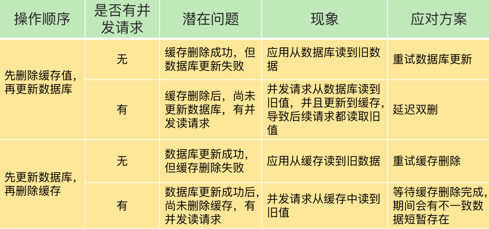

<!-- more -->

###  “数据的一致性”含义
  **缓存中有数据，那么，缓存的数据值需要和数据库中的值相同；
  缓存中本身没有数据，那么，数据库中的值必须是最新值。**

###  对于“读写缓存”的情况
  如果我们采用同步写回策略，那么可以保证缓存和数据库中的数据一致。
  所以，我们要在业务应用中使用**事务机制**，来保证缓存和数据库的更新具有**原子性**，
  也就是说，两者要不一起更新，要不都不更新，返回错误信息，进行重试。否则，我们就无法实现同步直写。
      
###  对于”只读缓存”的情况

### 参考：
25丨缓存异常（上）：如何解决缓存和数据库的数据不一致问题？

