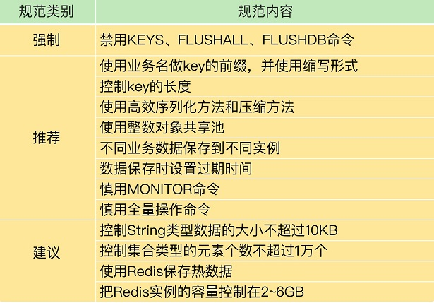

<!-- more -->

## 优化建议

## 优化建议[2]
+ 对象内存优化
+ 客户端缓冲优化
+ 碎片优化
+ 子进程内存优化

+ 序列化 + 压缩
  Renault（序列化： Json or Hession，压缩： Hession自带压缩 ）

## 参考
1. 加餐（六）| Redis的使用规范小建议
2. [Redis 内存优化在 vivo 的探索与实践](https://zhuanlan.zhihu.com/p/506470564) vivo 
