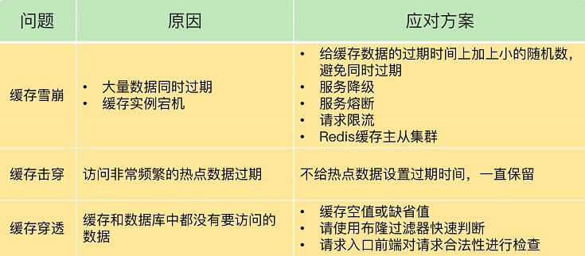

<!-- more -->

# 问题&方案 [1]

###  “有损”方案
  + 服务熔断、服务降级、请求限流这些方法都是属于**“有损”方案**，在保证数据库和整体系统稳定的同时，会对业务应用带来负面影响。

### 预防式方案
  + 建议是，尽量使用**预防式方案**
     - 针对缓存雪崩，合理地设置数据过期时间，以及搭建高可靠缓存集群；
     - 针对缓存击穿，在缓存访问非常频繁的热点数据时，不要设置过期时间；
     - 针对缓存穿透，提前在入口前端实现恶意请求检测，或者规范数据库的数据删除操作，避免误删除。

# 缓存击穿
+ 缓存击穿

### 原因
热点数据过期
大量并发请求
    
### 解决方案
唯一DB请求，共享结果
分布式锁

#  缓存穿透
### 原因 
  指缓存和数据库中都没有的数据，而用户不断发起请求，如发起为id为“-1”的数据或id为特别大不存在的数据。
  提交不在数据库中的查询，会击穿缓存，直接到达数据库。

###  解决方案
1. 回种空值
2. 使用bloomfilter
   

# 缓存穿透-狗桩效应[3]
###  原因
当有一个极热点的缓存项，它一旦失效会有大量请求穿透到数据库，这会对数据库造成瞬时极大的压力，我们把这个场景叫做**“dog-pile effect”（狗桩效应）**

###  解决方案
+ 后台线程定时加载
  在代码中，控制在某一个热点缓存项失效之后**启动一个后台线程，穿透到数据库，将数
  据加载到缓存中**，在缓存未加载之前，所有访问这个缓存的请求都不再穿透而直接返回。

+ 设置分布式锁
  通过在 Memcached 或者 Redis 中设置**分布式锁**，只有获取到锁的请求才能够穿透到数
  据库。

# 参考
1. 《26丨缓存异常（下）：如何解决缓存雪崩、击穿、穿透难题？》
2. [【直播回放】海量并发微服务框架设计](https://www.bilibili.com/video/BV1Gb4y187un?zw&vd_source=f6e8c1128f9f264c5ab8d9411a644036) V
3. 《15 | 缓存的使用姿势（三）：缓存穿透了怎么办？》