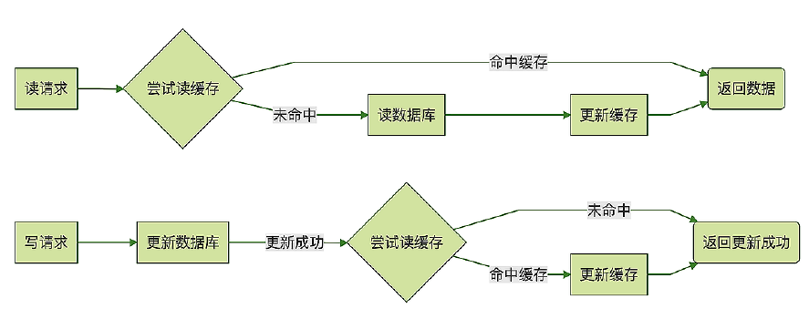

<!-- more -->

# 关键词
 失效策略(缓存更新)、  缓存与数据库的一致性

# 失效策略(缓存更新) [9]

### Read/Write Through模式

Read Through : 被动失效
Write Through ： 主动失效

###  Cache Aside 模式
Cache Aside 模式和上面的 Read/Write Through 模式非常像，它们处理读请求的逻辑是完全一样的，唯一的一个小差别就是，Cache Aside 模式在更新数据的时候，并不去尝试更新缓存，而是去删除缓存。

**普遍使用这种方式**

场景：
订单服务收到更新数据请求之后，先更新数据库，如果更新成功了，再尝试去删除缓存中订 单，如果缓存中存在这条订单就删除它，如果不存在就什么都不做，然后返回更新成功。这 条更新后的订单数据将在下次被访问的时候加载到缓存中。使用 Cache Aside 模式来更新 缓存，可以非常有效地避免并发读写导致的脏数据问题。

###  Write Behind模式
linux page cache: dirty page刷盘。
kafka使用page cache异步刷盘。

# 失效策略
+ 失效策略
	- 被动失效
		- 有空窗期问题
	- 主动更新【1】
		- 无空窗期问题
		- 有并发更新问题。并发写，数据覆盖一致性问题【2】
			- 锁控制,少有这样做的
				- 客户端读写锁
				- 服务端加锁
			- 版本控制
				- 单版本机制【3】
				- 多版本机制
				  - 类似向量时钟， NoSQL使用
	- 消息机制【3,4】
		- 增量db数据通过消息来异步变更缓存的数据

#  缓存的应用模式
+ 缓存的应用模式
	+ Cache-Aside
		- 业务代码直接维护缓存
		- 有并发更新问题【2】
	+ Cache-As-SoR
		- Read-Through
		- Write-Through
			- 同步写
		- Write-Behind
			- 异步写

# Cache与数据库的一致性
+ Cache与数据库的一致性
	+ 读操作
		- 先读缓存，再读数据库
	+ 写操作
		- 先写数据库，在写缓存

# 缓存与数据库的数据同步  一致性

  在应用层， 可以根据业务场景对一致性的要求不同， 给数据分配不同的队列，即
一致性分级队列。 强一致性的场景如自己发布的评论， 自己应该及时看到。 而别人看到我的评论属于会话一致性， 一致性要求比较弱。 这样可以把一致性要求高的业务分配更多资源， 做到快速同步。   
  缓存与数据库同步的异步化也是提高响应度的方式， 在write-behind的方式中，所有的数据的操作都在缓存中， 更新的数据并不会立即传到数据库。相反，在缓存中一旦进行更新操作，缓存就会跟踪脏记录列表，并定期将当前的脏记录集刷新到数据库中。

  ~~在DAO层的hibernate针对一致性的要求提出了类似DBMS的事务级别的4个配置项。 非严格读写型(nonstrict-read-write)策略提供弱一致性，不保证缓存与数据库中数据的一致性。如果存在两个事务同时访问缓存中相同数据的可能，必须为该数据配置一个很短的数据过期时间，从而尽量避免脏读。对于极少被修改，并且允许偶尔脏读的数据，可以采用这种并发访问策略。 事务策略(transactional )只可用于托管环境，如有必要，它还保证完全的事务隔离级别直到可重复读。事务策略可以用在强一致性的场景中。~~

# 过期策略
###  被动过期 （一致性低， 缓存超时）
对一致性要求较低的系统，可以采用常规的缓存超时策略，此类策略属于被动过期。
存放数据时，永不过期的数据不要与有过期策略的数据放在一起， 早期的版本memcache曾经有一个这样的bug， 永不过期的数据被有过期策略的数据踢走了。不要把所有的数据的过期时间设为同一个时间， 这样可能造成大规模的数据同时过期，hit rate变小， 对数据库的查询数瞬时变大，造成数据库的压力。 

###   主动过期（一致性高， 事件过期， 异步过期，  变化事件）
对一致性要求较高的系统，可以采用事件过期策略，此类策略属于主动过期。
      某个组件的结构发生变化，或者某个业务对象状态发生变化，把组件id或业务对象id放入过期队列中， 缓存节点异步读取这些数据， 将对应cache的对象移除。亦可把变化封装成事件放入过期队列中， 由代理处理这个事件， 异步的移除相应的缓存。         

###   基于版本的过期方式
在存储空间较大的前提下，借鉴mvcc的概念，每次更改数据时增加一个副本，并带版本号元数据。 然后由一个代理定时的删除低版本的过期的数据。

~~## 服务端缓存~~

~~缓存服务端常用的有memcache。 Nosql的解决方案有Redies，Redies在作为cache时往往配置为无持久化的形式 。两者数据模型都是key-value的。 Redies比老牌的memcache能提供更好的性能， 更快的速度。 Memcache 没有自建的replicaion 机制, 可靠性需要在客户端以双写支持。 Redies可以看成自带持久化机制的Write-back缓存，在write-behind缓存中，数据的读取和更新通过缓存进行，与write-through缓存不同，更新的数据并不会立即持久化。相反，在缓存中一旦进行更新操作，缓存就会跟踪脏记录列表，并定期将当前的脏记录集刷新到外部存储中， 在Redies中这种机制叫做AOF~~

# 参考
1. [应用系统数据缓存设计](https://www.geek-share.com/detail/2615401101.html) 淘宝技术部 *** 失效
2. Local Cache的小TIP  阿里 放翁（文初）
3. [阿里云分布式缓存OCS与DB之间的数据一致性](https://www.csdn.net/article/1970-01-01/2825234) 杨成虎
4. [缓存失效竟然可以这么解？](https://developer.aliyun.com/article/55842) serana_cai
5. xxx
6. 《亿级流量网站架构核心技术》 第9章 张开涛
7. xxx
8. [缓存更新的套路](https://coolshell.cn/articles/17416.html)  coolshell ***
9. 《后端存储实战课 - MySQL如何应对高并发（一）：使用缓存保护MySQL》  李玥
10. [浅谈缓存最终一致性的解决方案](https://zhuanlan.zhihu.com/p/554879252)   腾讯 未