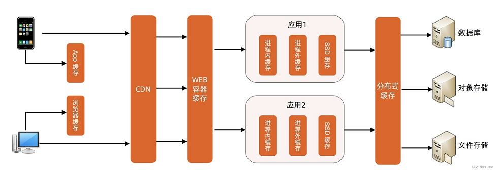
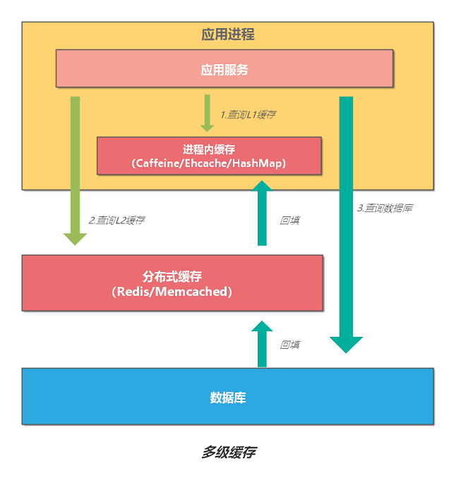

<!-- more -->

# Overview

# 多级缓存 [5?]
### 二级缓存（本地缓存+远程缓存）
+ 二级缓存（本地缓存+远程缓存）
	- 远端Cache推全量或者部分的数据到本地cache，并设置过期时间【初始化】
	- 查询流程
		- 先从本地缓存拿，如果有数据且有效，就直接返回
		- 如果没有命中
			- 1.本地查询远端服务，并拿到结果
			- 2.本地更新远端缓存
			- 3.更新本地缓存
	- 本地cache失效+更新流程,本地防穿透【1】
		- 同步更新缓存
			- 访问同一个key的业务线程只有一个线程穿透到远端Cache，其他线程等待穿透线程的返回结果[加锁]
		- 异步更新缓存
			- 1.过期时间到了后，产生过期事件，延长数据有效期，返回旧的数据
			- 2. 检查过期事件，后台线程池更新缓存数据，并重新设置有效时间
		- eg. Google LoadingCache 以上两种方式都有
	- 远端cache，防穿透
		- 远端cache访穿透采用永久缓存数据，每次查询都能查到值.
		- 通过辅助信息判断逻辑过期, 再从远端服务异步拉数据刷新远端cache。

# 多级缓存查询 [2]

# 多级缓存更新 [2]

# 缓存分层  多级缓存
###   边缘cache
可用CDN实现，往往是服务器端缓存，存静态数据。
可以存Html页面， 脚本， 样式， 图片，页面片段等。

###   页面级缓存 
往往是本地缓存， 数据相对动态。

###    计算结果的缓存
可以存储索引聚合数据，比如  BI里的数据聚合表。也可以存储耗时查询数据 ，比如搜索的结果。也可以存储业务相关数据， 比如对象模型的有向图可以整个缓存起来。在微博系统中，所有@你的微博是相对耗时， 可以 考虑作为逻辑缓存。

###   数据源级缓存： 缓存数据源结果集
~~比如Hibernate缓存中的QueryCache用来缓存查询语句, 及查询结果集中对象的Id与Type. 当再次使用已缓存的Query时, 就可以通过对象的Id与Type在二级缓存中查找实际的对象.~~

~~Hibernate提供了短生命周期的缓存， 也叫事务级别的缓存。长生命周期的缓存，也叫应用级别的缓存。~~

  缓存分层之间的失效方式： 1. 映射关系  2. 日志 ＋ 重试

~~## 缓存对象的粒度~~  

~~有一种缓存的误用是缓存大量的数据集合，而读取其中一部分。 在很多时候，我们往往会缓存一个对象的集合，但是，我们在读取的时候，只是每次读取其中一部分。 在更新缓存时， 读出整个集合， 改变其中一部分后， 在存回去， 这样序列化与反序列化的代价相当大~~

~~针对这个情况， jboss cache提供了两种粒度的对象存储：核心缓存（粗粒度的），POJO 缓存（细粒度的）~~

~~核心缓存会直接把您传递给它的数据存储在一个树型结构中。键／值对被存储在树的节点上，出于复制或持续性的需要它们都被序列化了。~~

~~POJO 缓存则采用比较复杂的机制——利用字节码编织来内省（introspecting）用户类，并向用户类的域添加侦听器，一旦域值有任何变化，侦听器会立刻 通知缓存。例如，如果要在POJO缓存中存储一个庞大、复杂的对象，会导致POJO缓存内省对象的字节码，最终只把该对象的原始域存储到树结构中。一旦域 值有所变化，缓存只复制这个改变了的域值而不会去复制整个用户类，这是高效的细粒度复制。~~

~~在缓存了细粒度的对象后， 造成的一个问题是数据的冗余。 例如查询条件1的返回的是model1, model2, model3, 查询条件2返回的是model2, model3, model4. model2, model3在缓存里就存了两份， 造成了冗余。这时可以分离出一个索引层，索引层存储缓存对象的地址， 这样可以节约大量的存储空间。 例如可以存储model1- model4的索引， 再从缓存中取得到实际的model.  在数据库中， 这种方式叫look up table. 如果系统更复杂， 可以采取缓存的partition加多级索引的方式~~

~~## 缓存与一致性~~

  ~~缓存多副本之间的同步：~~
  ~~可分为replication和invalidaiton机制。 Replication机制表示一旦有数据的更新， 其余副本都会同步复制一份更新后的数据。Replication机制复制时slave会对master节点有拖累， 这时可以考虑采取invalidation机制。 Invalidation机制在jboss cache里已有实现, 一旦有更新， 广播消息， 失效所有其他的副本，让其重新去获得该值。 可通过这种方式缓存大对象以减少在实例中复制对象的代价。根据用户在一定时间段内上网地点固定不变的规律，用户始终都是访问同一个机房， 针对主节点的本地缓存在有更新时可以异步发invalidation消息，副本节点可以慢慢的再加载回这个大对象， 这样可以提高用户响应度。这种方式也可用在边缘缓存中。对于无法分组的数据， 比如在某时间段的用户认证数据需要保证副本同步，最好的方式是清除相应的副本， 让它在下次使用时初始化~~

# 参考
1. [多级缓存架构](https://blog.csdn.net/lee_nacl/article/details/127860463)
   《架构实战营-第25节课：计算架构模式之多级缓存架构》 V
2. [解析分布式系统的缓存设计](https://zhuanlan.zhihu.com/p/497029871)
5. 《移动选购线缓存实践》 赵思奇 *** 

100. [jetcache：阿里这款多级缓存框架一定要掌握](http://wed.xjx100.cn/news/154282.html) 未
101. [聊聊微服务架构中的多级缓存设计（建议收藏）](https://blog.51cto.com/u_15989526/6287632) 未
102. [Java分布式缓存一篇文章让你明白你多级缓存的分层架构原理分析](https://zhuanlan.zhihu.com/p/606469614) 未

