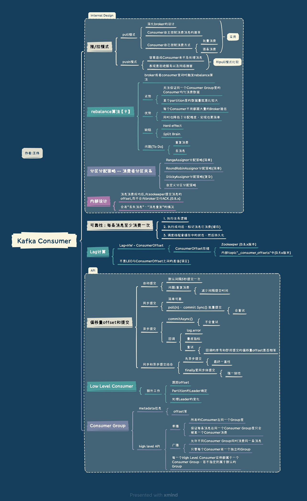

<!-- more -->

# Kafka消费者
### 总结

### lag

### 消费者
1. 批量消费  
2. 消费者的ZeroCopy:   
   直接把消息从文件里发送到网络通道， 而不需要内核与用户态之间数据的来回复制。  

# Q&A
+    ~~怎么计算Lag？(注意read_uncommitted和read_committed状态下的不同)~~
+    “消费组中的消费者个数如果超过topic的分区，那么就会有消费者消费不到数据”这句话是否正确？如果不正确，那么有没有什么hack的手段？
+    消费者提交消费位移时提交的是当前消费到的最新消息的offset还是offset+1?

+    有哪些情形会造成重复消费？  
     [Kafka常见的导致重复消费原因和解决方案](https://cloud.tencent.com/developer/article/1665700)  
     原因3:（重复消费最常见的原因）：消费后的数据，当offset还没有提交时，partition就断开连接。比如，通常会遇到消费的数据，处理很耗时，导致超过了Kafka的session timeout时间（0.10.x版本默认是30秒），那么就会re-blance重平衡，此时有一定几率offset没提交，会导致重平衡后重复消费。  
     
+    那些情景下会造成消息漏消费？  
     [Kafka 可靠性总结](../../../../2016/07/05/kafkaReliability/)  
     [聊聊 Kafka：Kafka 消息丢失的场景以及最佳实践](https://blog.csdn.net/riemann_/article/details/124534487)  

+    KafkaConsumer是非线程安全的，那么怎么样实现多线程消费？
+    简述消费者与消费组之间的关系
+    Kafka的旧版Scala的消费者客户端的设计有什么缺陷？

## 参考
1. [Kafka设计解析（四）- Kafka Consumer设计解析](http://www.jasongj.com/2015/08/09/KafkaColumn4/) 郭俊
5. [Kafka的Lag计算误区及正确实现](https://blog.csdn.net/u013256816/article/details/79955578) 朱小厮
6. 《kafka权威指南》 薛命灯 第3，4 ，5章
7. Kafka Consumer机制优化-保证每条消息至少消费一次 幽灵之使

+ 分区分配策略  
  [Kafka分区分配策略（1）——RangeAssignor](https://blog.csdn.net/u013256816/article/details/81123600) 朱小厮  
  [Kafka分区分配策略（2）——RoundRobinAssignor和StickyAssignor](https://blog.csdn.net/u013256816/article/details/81123625) 朱小厮  
  [Kafka分区分配策略（3）——自定义分区分配策略](https://blog.csdn.net/u013256816/article/details/81123858) 朱小厮  

  [图解Kafka消费者分区分配策略](https://mp.weixin.qq.com/s?__biz=Mzg4ODY1NTcxNg==&mid=2247494909&idx=1&sn=e40cd749d060093695e39576c41a9264)   石臻臻 kafka contributor  *** 未

