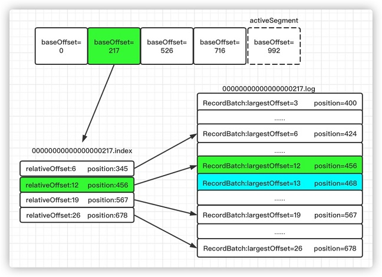

<p></p>
<!-- more -->

## Kafka索引
+ 稀疏索引

### LogSegment 构成
``` shell
$ tree /tmp/kafka-logs/t1-1/
/tmp/kafka-logs/t1-1/
├── 00000000000000000000.index
├── 00000000000000000000.log  ## 位移索引
├── 00000000000000000000.timeindex  ## 时间戳索引
└── leader-epoch-checkpoint
```

### Index类型 
- 位移索引 [3]
   
  + 假设要查找偏移量为230的消息，查找过程如下：
    - 首先找到baseOffset=217的日志段文件（这里使用了跳跃表的结构来加速查找）
    - 计算相对偏移量relativeOffset=230-217=13
    - 在索引文件中查找不大于13的最大相对偏移量对应的索引项，即[12,456]
    - 根据12对应的物理地址456，在日志文件.log中定位到准确位置
    - 从日志文件物理位置456继续向后查找找到相对偏移量为13，即绝对偏移量为230，物理地址为468的消息


- 时间戳索引 [3]
  
  + 假设要查找时间戳为1540的消息，查找过程如下（这里时间戳只是一个示意值）：
    -  将要查找的时间戳1540和每个日志段的最大时间戳逐一对比，直到找到最大时间戳不小于1540的日志段。（日志段的最大时间戳：获取时间戳索引文件最后一个索引项的时间戳，如果大于0，取该值；否则取日志段的最近修改时间）
    - 找到对应的日志段后，在时间戳索引文件中使用二分查找找到不大于目标时间戳1540的最大索引项，即图中的[1530,12]，获取对应的相对偏移量12
    - 在该日志段的偏移量索引文件中找到相对偏移量不大于12的索引项，即图中的[12，456]
    - 在日志文件中从物理位置456开始查找时间戳不小于1540的消息

- 位移索引 vs 时间戳索引 [2]


###  改进版二分查找算法 [1]
+ 在位移索引 和 时间戳索引中都使用二分查找算法

+ 示例
  现在，最新索引项保存在 Page #13 中。如果要查找最新索引项，原版二分查找算法将会
  依次访问 Page #0、7、10、12 和 13。此时，问题来了：Page 7 和 10 已经很久没有被
  访问过了，它们大概率不在页缓存中，因此，一旦索引开始征用 Page #13，就会发生
  **Page Fault，**等待那些**冷页数据从磁盘中加载到页缓存**。根据国外用户的测试，这种加载过程可能长达 1 秒。


## 日志模块 Q&A

+    ~~简述Kafka的日志目录结构~~
+    ~~Kafka中有那些索引文件？~~
+    ~~如果我指定了一个offset，Kafka怎么查找到对应的消息？~~
+    ~~如果我指定了一个timestamp，Kafka怎么查找到对应的消息？~~
+    聊一聊你对Kafka的Log Retention的理解
+    聊一聊你对Kafka的Log Compaction的理解
+    聊一聊你对Kafka底层存储的理解（页缓存、内核层、块层、设备层）

## 参考
1. 《04 | 索引（上）：改进的二分查找算法在Kafka索引的应用》
2. 《05丨索引（下）：位移索引和时间戳索引的区别是什么？》
3. [深入理解Kafka服务端之索引文件及mmap内存映射](https://blog.csdn.net/qq_32907195/article/details/127635622) *** 
