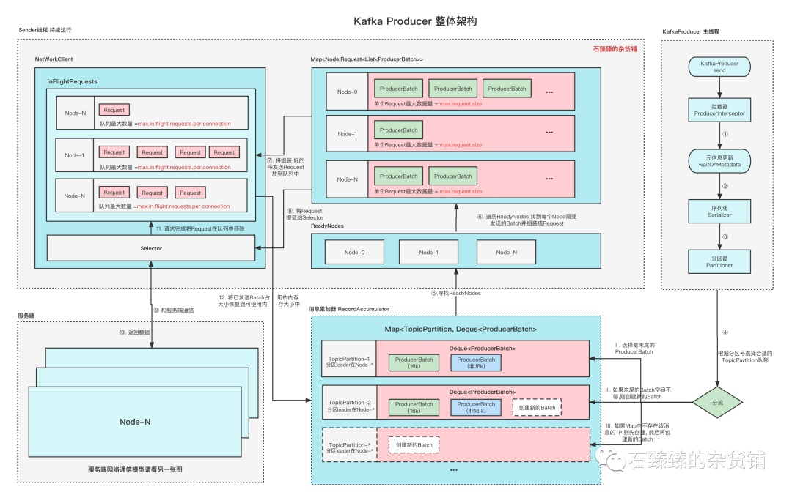
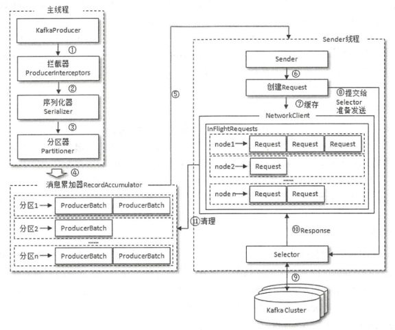

<!-- more -->

## Producer 架构
### Overviw 1 [1]

整个生产者客户端是由主线程和Sender线程协调运行的, 主线程创建消息, 然后通过 拦截器、元信息更新、序列化、分区器、缓存消息等等流程。
Sender线程在初始化的时候就已经运行了,并且是一个while循环。

### Overviw 2

## Producer 分区策略[2]
+ DefaultPartitioner 默认分区策略
  粘性分区Sticky Partitioner
+ UniformStickyPartitioner 纯粹的粘性分区策略
+ RoundRobinPartitioner 分区策略

## kafka 生产者 里的buffer[3]
kafka producer中配置的 buffer.memory （参数在文末有详细说明）参数是缓冲区的大小，这个缓存区大家也就是RecordAccmulator所用的内存大小。默认是32MB。

## 参考
1. [图解kafka生产者流程,超详细！](https://mp.weixin.qq.com/s?__biz=Mzg4ODY1NTcxNg==&mid=2247493639&idx=1&sn=4bd43c8137a701e73dddd9ccdf58ad45&c)  石臻臻   kafka contributor  
2. [Kafka生产者的3种分区策略 ](https://mp.weixin.qq.com/s?__biz=Mzg4ODY1NTcxNg==&mid=2247493592&idx=1&sn=4a4f536b21f1b6b1d506dd1bdfa07e80) 石臻臻   kafka contributor  
3. [Kafka Producer全流程分析和思考](https://blog.csdn.net/xixiqiuqiu/article/details/122806693)
