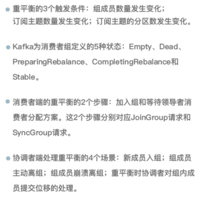

<!-- more -->

# Rebalance (What)
+ Rebalance 定义   
  + 在同一个消费者组当中，分区的所有权从一个消费者转移到另外一个消费者  

+ 原理  
  + **重平衡的通知机制正是通过心跳线程来完成的** [7]

+ 角色  
  + consumer leader  
  + cordinator[8]  
     
# Rebalance 发生的时机有三个 (when) [1]
+ 重平衡的 3 个触发条件：  
**组成员数量发生变化。(最常遇到)**  
订阅主题数量发生变化。  
订阅主题的分区数发生变化。  

# 问题和解决方案
###  Rebalance 的 弊端 [1]
+ Rebalance 影响 Consumer 端 TPS  
  在 Rebalance 期间，Consumer 会停下手头的事情，什么也干不了  
+ 如果你的 Group 下成员很多， Rebalance 会很慢。  
+ Rebalance 效率不高  
  Group 下的 所有成员都要参与进来，而且通常不会考虑局部性原理  

### consumer rebalance 的问题
+ Rebalance 过程也和这个类似，在 Rebalance 过程中，所有 Consumer 实例都会停止消费，等待 Rebalance 完成。  这是 Rebalance 为人诟病的一个方面。  
【消费者重平衡的时候， 所有的消费者是不能消费数据的。】  

###  “不必要的”的Rebalance (Solution) [1]
+ 第一类非必要 Rebalance 是因为未能及时发送心跳，导致 Consumer 被“踢出”Group 而引发的。
因此，你需要仔细地设置session.timeout.ms 和 heartbeat.interval.ms的 值。  

+ 第二类非必要 Rebalance 是 Consumer 消费时间过长导致的。  
  max.poll.interval.ms参数值的设置显得尤为关键。  

# 总结

# Q&A
+ 消费再均衡的原理是什么？（提示：消费者协调器和消费组协调器）

# 参考
1. 《17 | 消费者组重平衡能避免吗? 》  胡夕
2. 《15丨消费者组到底是什么？》  胡夕
3. 《25 | 消费者组重平衡全流程解析》  胡夕
4. [Kafka的Rebalance机制可能造成的影响及解决方案](https://blog.csdn.net/lzxlfly/article/details/106246879)
5. [线上Kafka突发rebalance异常，如何快速解决？](https://www.cnblogs.com/chanshuyi/p/kafka_rebalance_quick_guide.html)
6. [为什么消费客户端频繁出现Rebalance？](https://help.aliyun.com/knowledge_detail/154454.html)  石臻臻
7. [Kafka消费者客户端心跳请求](https://mp.weixin.qq.com/s?__biz=Mzg4ODY1NTcxNg==&mid=2247494990&idx=1&sn=54f626f66b8d0c1330a586ca800b1609)  石臻臻
8. [什么是Kafka消费组协调器](https://mp.weixin.qq.com/s?__biz=Mzg4ODY1NTcxNg==&mid=2247494917&idx=1&sn=e1b18b70b58a3e9797a0110972a9d43e)  石臻臻

