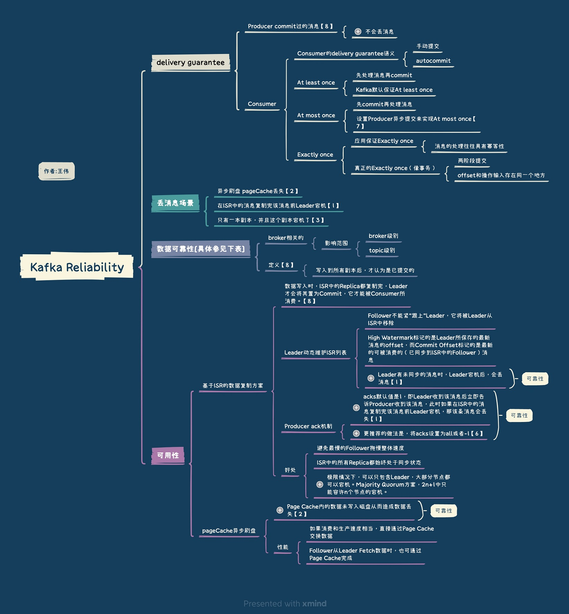

<!-- more -->

## Kafka高可靠配置

位置 | 配置项| 可靠性
---|:-:|:-:
topic的配置|replication.factor>=3,即副本数至少是3个 |复制因子 replication.factor(topic级别)  default.replication.factor(broker级别)
-|2<=min.insync.replicas<=replication.factor   最少同步副本min.insync.replicas| 3副本（总） + 3副本，一般最少同步2副本  + 最少同步2副本时，如2副本挂了，这时不能写，只能读. 设置为1，单副本挂了，就会丢数据【3】
broker的配置|leader的选举条件unclean.leader.election.enable=false   unclean.leader.election -> broker级别 |1.允许不同步的副本成为首领 ，有数据不可靠的风险. 2.不允许不同步的副本成为首领 ，降低了可用性.  3. 强烈建议不要开启它，还可以通过其他的方式来提升可用性
producer的配置|request.required.acks=-1(all)【6】   producer.type=sync【7】|

## 如何确保消息不会丢失
##### 生产阶段 
+ 在编写**发送**消息代码时，需要注意，**正确处理返回值或者捕获异常**，就可以保证这个阶段的消息不会丢失。  
捕获消息发送的错误，并**重发消息**。  
+ **异步发送时**，则需要在回调方法里进行检查。这个地方是需要特别注意的，**很多丢消息的原因就是，使用了异步发送，却没有在回调中检查发送结果**。  

##### 存储阶段 
+ 通过配置**刷盘**和**复制**相关的参数，让消息写入到多个副本的磁盘上，来确保消息不会因为某个 Broker 宕机或者磁盘损坏而丢失。  
Eg. 在 RocketMQ 中，需要将刷盘方式 flushDiskType 配置为 SYNC_FLUSH 同步刷盘  
Eg. **表. kafka高可靠配置**  topic的配置  

##### 消费阶段 
+ **在处理完全部消费业务逻辑之后，再发送消费确认。**

## 检测消息丢失的方法
可以利用消息队列的有序性来验证是否有消息丢失。在 Producer 端，我们给每个发出的消息附加一个连续递增的序号，然后在 Consumer 端来检查这个序号的连续性。

## Q&A
+    怎么样才能确保Kafka极大程度上的可靠性？  
+    Kafka在可靠性方面做了哪些改进？（HW, LeaderEpoch）  
[Kafka 可靠性总结](../../../../2016/07/05/kafkaReliability/)

## 参考:
1. [Kafka设计解析（六）- Kafka高性能架构之道](http://www.jasongj.com/kafka/high_throughput/) 郭俊   
2. [kafka数据可靠性深度解读](https://blog.csdn.net/u013256816/article/details/71091774) 朱忠华
3. 《Kafka权威指南》 第6 章可靠的数据传递 薛命灯
4. 《消息队列高手课 - 如何确保消息不会丢失？》 李玥
