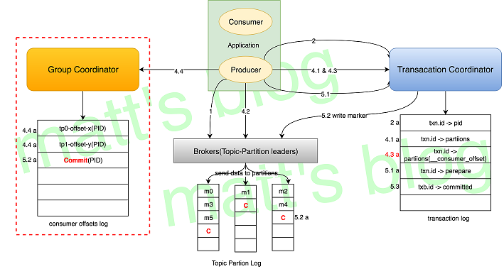
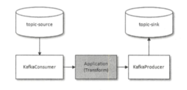

<p></p>
<!-- more -->

## Kafka 幂等性

+ 为了实现生产者的幂等性， 引入了producer id（PID）和 序列号（sequence number）  
  **PID**: producer 初始化的时候分配  
  **序列号**： producer每发送一条消息，就会将<PID, 分区>对应的序列号的值+1.  

+ 局限性： Kafka 幂等性只能保证单个producer 回话（session）中单分区的幂等


## Kafka 事务

+ Kafka 幂等性不能跨多个分区运作，而事务可以保证对多个分区写入操作的原子性。

##### 事务性实现的关键

+ 事务要求producer 开启幂等特性  
```
enable.idempotence = true
```

+ transactionalId：  
  一个Producer 在 Fail 恢复后能主动 abort 上次未完成的事务（接上之前未完成的事务），然后重新开始一个事务，这种情况应该怎么办？  
  之前幂等性引入的 PID 是无法解决这个问题的，因为每次 Producer 在重启时，PID 都会更新为一个新值：  
  Kafka 在 Producer 端引入了一个 transactionalId 来解决这个问题，这个 txn.id 是由应用来配置的；  


##### 架构和组件


+ transactionalId和PID一一对应，transactionalId用户显示设置，PID由Kafka内部分配；
+ 跨producer会话的消息**幂等发送**: 新的producer启动后，具有相同transactionalId的旧producer会立即失效；
+ 跨producer会话的**事务恢复**: producer宕机后，新的producer可以保证未完成的旧事务要么commit，要么Abort。
+ TransactionCoordinator(coordinate 协调者)
+ 事务日志

##### 语义
+ Kafka 的事务机制，更多的情况下被用来配合Kafka的幂等机制来实现 Kafka 的 **Exactly Once** 语义。
+ Kafka 的 Exactly Once 机制，是为了解决在**"consume - transform - produce"（流计算）**这样的计算过程中数据不重不丢，而不是我们通常理解的使用消息队列进行消息生产消费过程中的 Exactly Once。
+ ”consume - transform - produce“模式
	+ 

## 总结
幂等性、事务都是0.11.0.0之后引入的特性, 以此来实现EOS（Exactly-Once semantics 精确一次性语义）

## Q&A
+    Kafka中的幂等是怎么实现的   
+    Kafka中的事务是怎么实现的（这题我去面试6家被问4次）   
     [Kafka 幂等性和事务](../../../../2022/05/04/kafkaTransaction/)  

## 参考:
1. [消息队列高手课 - 25 | RocketMQ与Kafka中如何实现事务？]() 李玥
2. [Kafka Exactly-Once 之事务性实现](http://matt33.com/2018/11/04/kafka-transaction/)  Matt's Blog-柳年思水
3. <<深入理解Kafka：核心设计与实践原理>>  7.4节