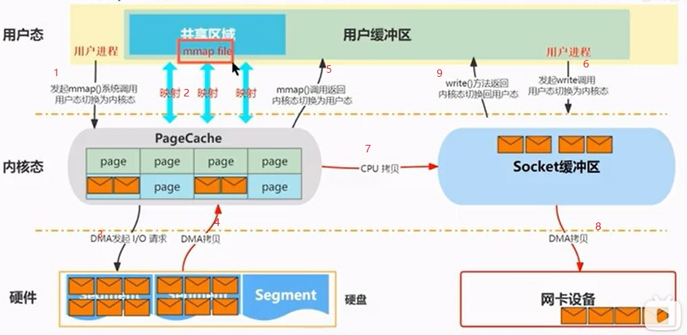
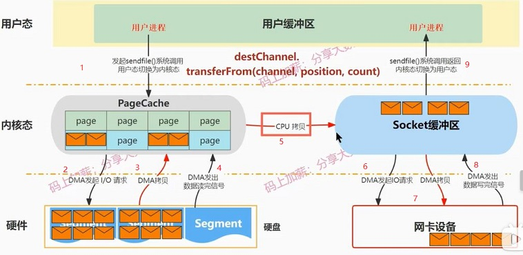

<p></p>
<!-- more -->


## Index 中的mmap
在 AbstractIndex 中，这个 MappedByteBuffer 就是名为 **mmap** 的变量。
接下来，我用注释的方式，带你深入了解下这个 mmap 的主要流程。

``` Scala
@volatile protected var mmap: MappedByteBuffer = { 
// 第1步：创建索引文件
val newlyCreated = file.createNewFile() 
// 第2步：以writable指定的方式（读写方式或只读方式）打开索引文件
val raf = if (writable) new RandomAccessFile(file, "rw") else new Rando
try {    
  if(newlyCreated) {       
    if(maxIndexSize < entrySize) // 预设的索引文件大小不能太小，如果连一个索引
    throw new IllegalArgumentException("Invalid max index size: " + m
    // 第3步：设置索引文件长度，roundDownToExactMultiple计算的是不超过maxInde
    // 比如maxIndexSize=1234567，entrySize=8，那么调整后的文件长度为1234560
    raf.setLength(roundDownToExactMultipl
```

这些代码最主要的作用就是创建 mmap 对象。AbstractIndex 其他大部分的操作都是和 mmap 相关。

AbstractIndex：这是 Kafka 所有类型索引的抽象父类，里面的 mmap 变量是实现索引机制的核心。

### mmap+write [4][5]
+ 4次context切换 



## 消费者中的sendfile()  [6]


+ *kafka的mmap是对写的优化，还是读的优化？*

## 参考
4. [动画讲解：Kafka为什么快之零拷贝技术 -- mmap](https://www.bilibili.com/video/BV1Sy4y1o7Ej/)
5.  self
6. [动画讲解：Kafka为什么快之零拷贝技术-sendfile()函数](https://www.bilibili.com/video/BV1NX4y1f7e2/) *** 


98. [Kafka Zero-Copy 使用分析](https://blog.csdn.net/allwefantasy/article/details/50663533)  transferTo()  未
99. [linux零拷贝原理，RocketMQ＆Kafka使用对比](https://cloud.tencent.com/developer/news/333695) *  未
100. [RocketMQ入门（上）](http://www.uml.org.cn/zjjs/201504011.asp)  未
