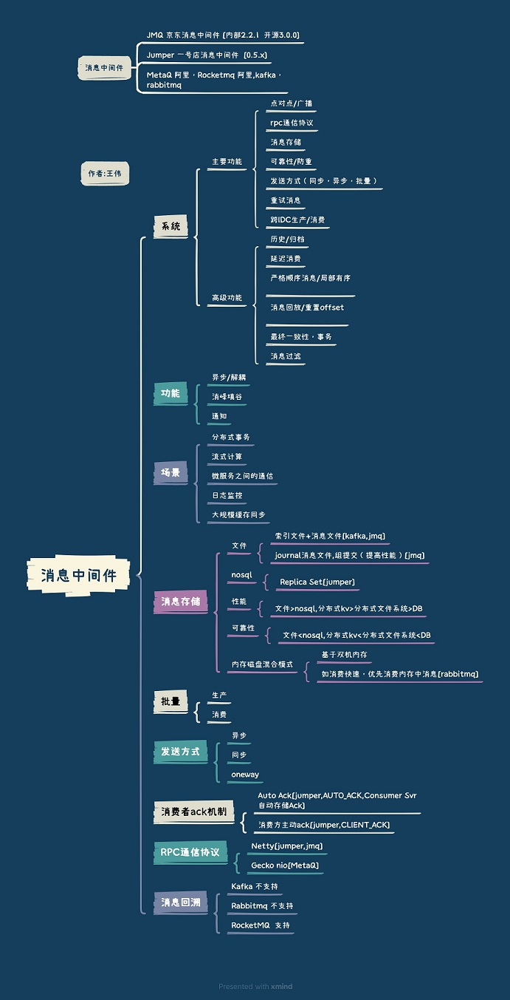
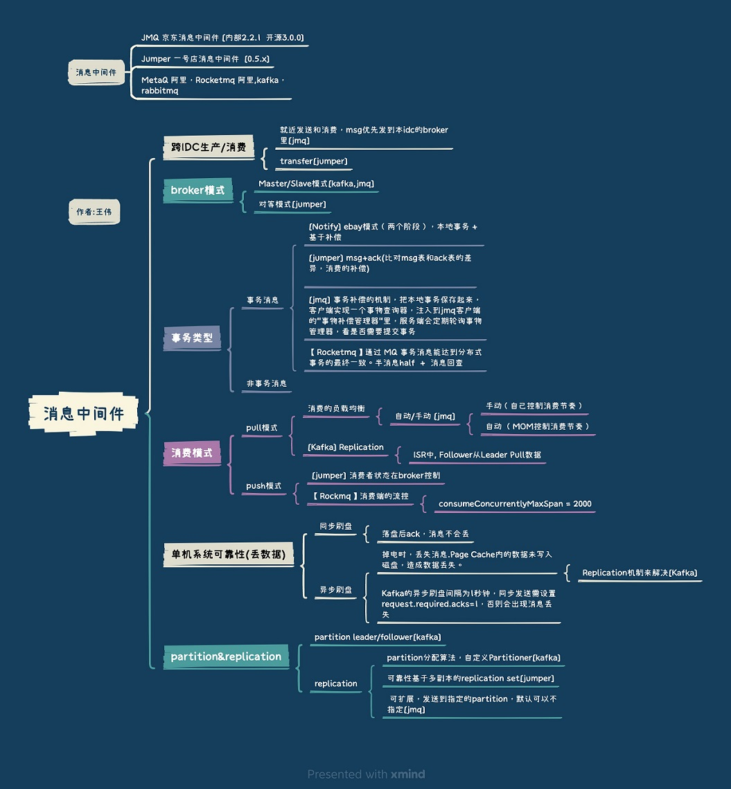
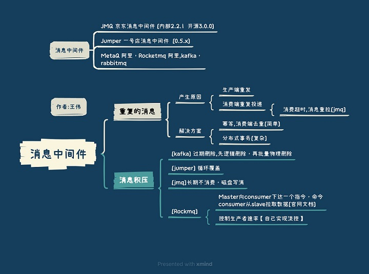

<!-- more -->

## 消息积压
### 原则: 消费性能要高于生产的性能
### 1. 发送端性能优化
**并发**和**批量**

### 2. 消费端性能优化
**分区partion**和**consumer同步扩容**

## 参考
1. Jumper, JMQ 代码 文档
2. Kafka vs RocketMQ——单机系统可靠性 以夕
3. xxx
4. [分布式开放消息系统(RocketMQ)的原理与实践](https://www.jianshu.com/p/468176c6bc1b) CHEN川 ***
5. [消息队列设计精要](https://tech.meituan.com/2016/07/01/mq-design.html)  点评 王烨 失效 
6. [Kafka设计解析（六）- Kafka高性能关键技术解析](http://www.jasongj.com/kafka/high_throughput/) 郭俊
7. 事务消息 -> 消息队列 RocketMQ 阿里云官方文档
8. 消息队列 RocketMQ、Apache RocketMQ、消息队列 Kafka、Apache Kafka、RabbitMQ 产品对比 阿里云官方文档
9. [RocketMQ消息堆积判断](https://blog.csdn.net/u013068377/article/details/72903288)
10. rocketMQ消息堆积监控的java实现 c614756zhang
11. [RocketMQ原理（4）——消息ACK机制及消费进度管理](https://zhuanlan.zhihu.com/p/25265380) Jaskey Lam

