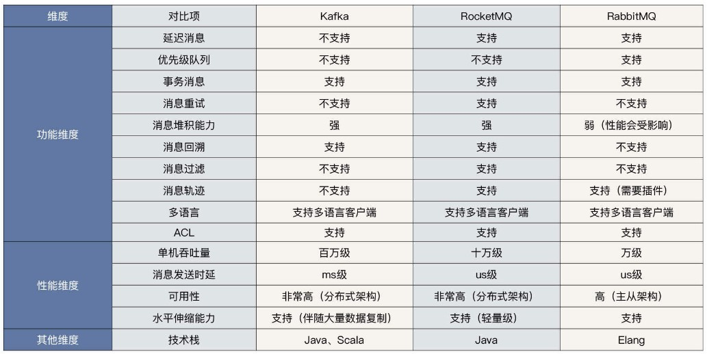

<!-- more -->

功能 | RocketMQ | Kafka | RabbitMQ
:-: | :-: |:-: | :-:
可靠性* | - 同步刷盘  - 异步刷盘| 异步刷盘，丢数据概率高 |  同步刷盘
横向扩展能力 | 支持 |  支持 | - 集群扩容依赖前端   - LVS 负载均衡调度
消费模型* | Push/Pull |  Pull | Push/Pull
定时消息* | 支持（只支持18个固定 Level）| 不支持 | 支持
顺序消息* | 支持 | 支持  | 不支持
消息堆积能力 | 百亿级别 影响性能 | 影响性能 | 影响性能
消息堆积查询 | 支持 | 不支持 | 不支持
消息回溯 | 支持 | 支持（位置，时间） | 不支持
消息重试 | 支持 |  生产者有重试机制 | 支持
死信队列 | 支持 | 不支持 | 支持
性能（常规）* | 非常好 十万级 QPS | 非常好 百万级 QPS | 一般 万级 QPS
性能（万级 Topic 场景）| 非常好 十万级 QPS |  低 | 低
性能（海量消息堆积场景） | 非常好 十万级 QPS |  低 | 低
全链路消息轨迹 | 不支持 | 不支持 | 不支持

## MQ比较[3]

## 重点[3]
+ 功能级别不具备一票否决权
+ 选型时要特别注意中间件的性能与扩展性
+ 需要注重团队技术栈与中间件编程语言的匹配度

## 参数
1. [Kafka、RabbitMQ、RocketMQ等消息中间件的对比](https://blog.csdn.net/belvine/article/details/80842240)
2. https://honeypps.com/mq/kafka-vs-rabbitmq/   未
3. 13 | 技术选型：如何根据应用场景选择合适的消息中间件？   丁威