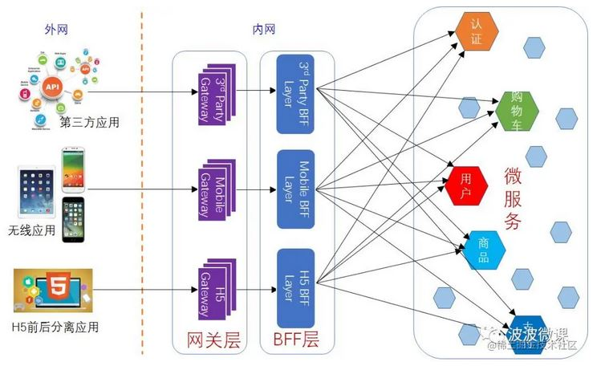

<!-- more -->

# 特性
+ 路由
+ 灰度发布
+ 反向代理,负载均衡
+ 鉴权
+ 限流
+ 监控
+ 缓存

# 分类
+ 入口网关 
+ 出口网关

# 框架

| 产品    | 技术                 |
| ------- | -------------------- |
|  self | lua + Nginx          |
| Kong    | lua + Nginx          |
| Zuul    | Spring Cloud Netflix |
|  self | Spring Cloud         |
| Traefik | Golang               |

# 实现 [3]
+ 扩展性  
  责任链模式 - Zuul filter, Envoy filter  
+  性能  
  多路 I/O 复用模型  和  线程池  
+ 可用性   
  线程池  服务隔离  

# API Gateway+BFF 
### API Gateway + BFF [3]
流量网关 + 业务网关

### BFF 聚合网关 [2]

# 参考
1. [使用 API 网关构建微服务](https://www.infoq.cn/article/construct-micro-service-using-api-gateway/)
2. [微服务架构：BFF和网关是如何演化出来的？](https://juejin.cn/post/6844903806208049159)
3. 《27 | API网关：系统的门面要如何做呢？》
100. [百亿规模API网关服务Shepherd的设计与实现](https://tech.meituan.com/2021/05/20/shepherd-api-gateway.html) 点评 未
101. [Go to Page](k8sIngressNginx.md)  self

