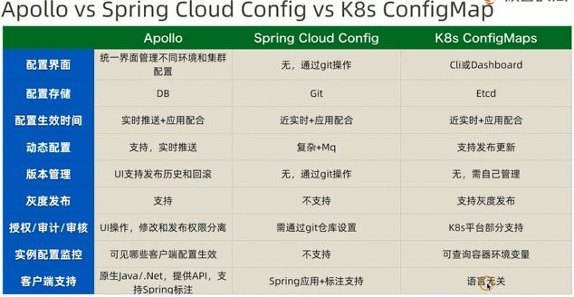

<!-- more -->

## 需求
+ 对实时性要求不高
+ 对可用性要求高

## 产品

产品 | 存储
:-:|:-:
Disconf 百度 | mysql 
Apollo 携程 | mysql 
QConf 360| zookeeper 
微博  | redis  
美图 | etcd 
spring cloud config | git

## 参考：
1. [Spring Boot与Kubernetes云原生微服务实践]() 杨波
