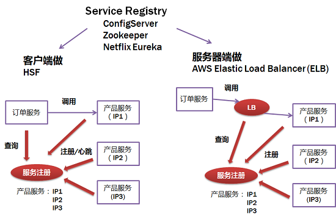

<!-- more -->

# 机制
### Overview
服务注册和发现

### 模式
+ Client-side Discovery  
+ Server-side Discovery patterns

# 实现
### 需求 [1]
RPC 框架依赖的注册中心的服务数据的一致性其实**并不需要满足 CP，只要满足 AP 即可**。

### Framework
+ etcd -  CP
+ nacos 
  基于raft协议
+  zk  -  CP
+  eureka -  AP  

# 参考
1. 《08 | 服务发现：到底是要CP还是AP？》