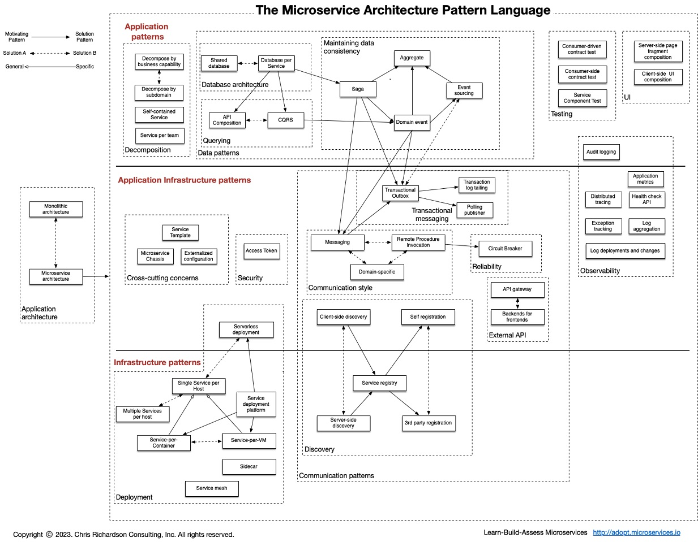

<!-- more -->

## 目录
<!-- toc -->

# 微服务 定义

In short, the microservice architectural style [1] is an approach to developing a single application as a suite of **small services**, **each running in its own process** and **communicating with lightweight mechanisms**, often an HTTP resource API. These services are built around business capabilities and **independently deployable** by fully automated deployment machinery. There is a bare minimum of centralized management of these services, which may be written in different programming languages and use different data storage technologies.   --  [Martin Fowler]

#  Core
###  API网关  
[serviceGovernanceSummary](../serviceGovernanceSummary/_index.md)   self 

###  服务容错
[serviceGovernanceSummary](../serviceGovernanceSummary/_index.md) self

###  服务注册和发现
[serviceGovernanceSummary](../serviceGovernanceSummary/_index.md)  self

###  服务间调用
   [Micro Service Architecture](https://yobriefca.se/blog/2013/04/29/micro-service-architecture/)
   [Microservice 微服务的理论模型和现实路径](http://blog.csdn.net/mindfloating/article/details/51221780)

#####  服务契约
+ API，具体接口的 API 接入技术说明。
+ 能力，服务能力的描述。
+ 契约，提供这些能力所约定的一些限制条件说明。
+ 版本，支持的最新和历史的版本说明。

#####  调用协议
+ 同步 HTTP
  REST（JAX-RS）
  RPC（Dubbo）

+ 异步消息
  Kafka, RabbitMQ, Notify
  AMQP, MQTT, STOMP
  

   

   
   

###   服务部署和发布

[微服务部署：蓝绿部署、滚动部署、灰度发布、金丝雀发布](https://my.oschina.net/xiaominmin/blog/3070053)

+ 部署模式
+ Single Service per Host  
+ Multiple Services per Host patterns

# Design
###   服务划分和组合

> 微服务不是指"微小"的服务, 而是如何"拆分"服务,然后"组合"服务.

+ DDD 领域驱动设计, 上下文划分（context）
+ 康威定律

###   服务分层
##### 上层: 聚合服务（适配服务， 边界服务）
    比如：pc和mobile服务对商品服务返回内容的裁剪。
          聚合商品服务和目录服务的内容。   

##### 下层: 基础服务（核心领域服务， 公共服务）
    比如：电商的商品服务， 目录服务， 订单服务

#  Design-微服务设计模式 
###  Overview     

###  Sidecar [11]
分离业务逻辑与路由，流控，熔断，幂等，服务发现，鉴权等控制组件。

适用场景：
老系统改造扩展，Sidebar 进程与服务进程部署在同一个节点；
多语言混合分布式系统扩展；

Eg. k8s pod中日志采集sidecar

#  The Scale Cube 可伸缩性
[The Scale Cube](https://akfpartners.com/techblog/2008/05/08/splitting-applications-or-services-for-scale/)

>   X-Axis: Horizontal Duplication and Cloning of services and data
    Y-Axis: Functional Decomposition and Segmentation - Microservices (or micro-services)
    Z-Axis: Service and Data Partitioning along Customer Boundaries - Shards/Pods

>   X-Axis: Replicate && Load Balance
    Y-Axis: Servcie
    Z-Axis: Data Sharding

#  微服务的优势和代价

[MicroservicePremium](https://martinfowler.com/bliki/MicroservicePremium.html) Martin Fowler. 

生产率和复杂度之间的关系。 

> 在不复杂的系统中， 更适合monolithic的应用。
  复杂度增长时， 微服务的生产率能持续保持，在生产率方面是可伸缩的。

#  原则和缺点（挑战）

[微服务架构——不是免费的午餐](https://www.phodal.com/blog/microservices-is-not-a-free-lunch/) 
[有关微服务架构的争论：更简单还是更复杂？](http://www.infoq.com/cn/news/2014/05/micro-server-architecture-debate) 

原则 |优点 |缺点 |挑战
:-: |:-: |:-: |:-:
**分布式**服务组成的系统； 去中心化| 可用性高|多服务运维难度 | 分布式系统的复杂性（容错，延迟，分布式事务）
按照业务而不是技术来划分组织| 服务独立无依赖 |系统部署依赖| 事务、异步、测试面临挑战
做有生命的**产品**而不是项目| 技术栈灵活||  运营开销
Smart endpoints and dumb pipes（强服务个体和轻量级通信）; 可组合的服务|独立按需扩展和伸缩|服务间通信成本 | 隐式接口[接口变更成本]
自动化运维（**DevOps**） | | 系统集成测试 | DevOps 要求
**容错**| 可用性高 |  数据一致性 | 性能监控; 分布式系统的复杂性
快速**演化**| 开发简单 |重复工作  | 系统集成测试 

#  SOA、微服务、云原生演进

关注点  |SOA  |微服务 |云原生
:-:|:-:|:-:|:-:
研发过程| CMM/RUP | Agile| Agile 
交付流程| 手工/自动化 | DevOps DevSecOps| GitOps[12] AIOps NoOps(Serverless)
服务通信| Web Service（WSDL，Soap）| REST/私有RPC协议（Dubbo）|REST/gRPC,Envoy xDS， MSI协议等开放协议
功能扩展性-filter| x| AOP filter  Dubbo filter chain    WEB filter/lisnter | Envoy filter
功能扩展性-微内核| x| Dubbo SPI | K8s CRD, Operator 
服务治理| ESB        | 微服务/API网关（SpringCloud），去中心化, sidecar | 服务网格（ [istio](../../../../2019/07/02/istio/) ， Linked） 分布式
应用运行环境| 物理机/虚拟机|虚拟机/容器 | Kubernete（操作系统）+ Serverless（Knative）
基础设施| IDC | 公有云/私有云 | 无边界的云（多云/混合云、 云+边+端）
总结|重  | 轻, 快速   | 开放、融合  

# 参考
1. [Introduction to Microservices](https://www.nginx.com/blog/introduction-to-microservices/)  英文  
2. [Introduction to Microservices](https://kb.cnblogs.com/page/521880/)  中文  优缺点
3. [微服务（Microservice）那点事](https://yq.aliyun.com/articles/2764?spm=5176.100239.blogcont59193.8.R9MzN9) ***
4. [Pattern: Microservice Architecture](https://microservices.io/patterns/microservices.html)  ***
5. [一致性](../../../2016/02/09/consistent/)  self
6. [微服务：分解应用以实现可部署性和可扩展性](http://www.infoq.com/cn/articles/microservices-intro)  Chris Richardson
7. [《Linux/Unix设计思想》随笔 ——Linux/Unix哲学概述](https://www.cnblogs.com/suter/p/3401952.html)  未
8. [微服务学习资料汇总](https://www.infoq.cn/article/2014/07/microservice-learning-resources/)  ***
9. [微服务架构技术栈选型手册](https://www.infoq.cn/article/micro-service-technology-stack/?utm_source=infoq&utm_medium=popular_widget&utm_campaign=popular_content_list&utm_content=homepage) 未
10. [从 SOA 到微服务，企业分布式应用架构在云原生时代如何重塑？](https://mp.weixin.qq.com/s/zl0Z-bCoLDFGD8GFYh68CQ) 阿里 易立  *** 
11. [云原生时代，分布式系统设计必备知识图谱（内含22个知识点）](https://mp.weixin.qq.com/s?__biz=MzUzNzYxNjAzMg==&mid=2247486600&idx=1&sn=0ad92a1fe535f141fe2e8c87ffbd1229&chksm=fae50747cd928e51c05c41d2cc206069babbe9dfdba5957c52ac6e77cb754192169bb6b3e898&scene=0&xtrack=1#rd) 杨泽强（竹涧） ***
12. [使用托管服务网格实现应用在多集群中的 GitOps 全自动化渐进式发布](https://www.servicemesher.com/blog/202003-gitops-progressive-delivery-with-asm/)  郝树伟 阿里云容器服务

    ​    

