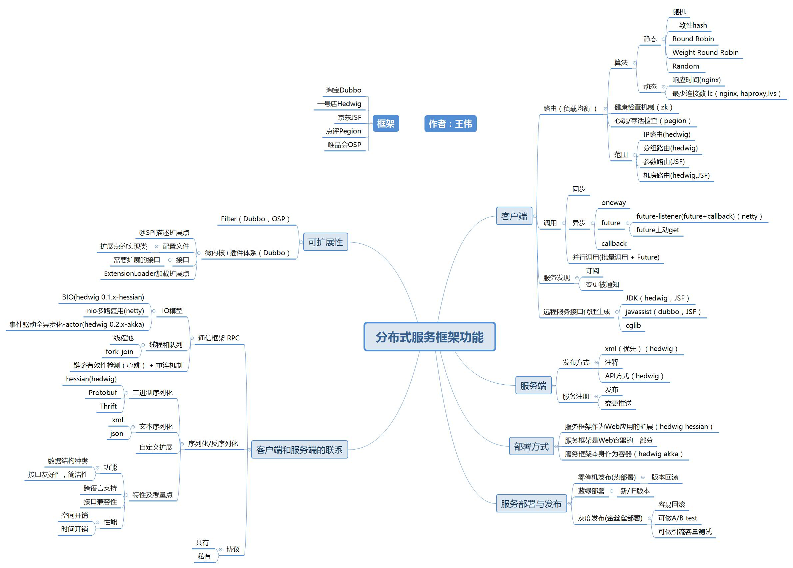

<!-- more -->

+ 负载均衡
RR
Least Connections
Least Time
“Power of Two Choices”

## 参考
[NGINX and the “Power of Two Choices” Load-Balancing Algorithm](https://www.nginx.com/blog/nginx-power-of-two-choices-load-balancing-algorithm/)
[【直播回放】海量并发微服务框架设计](https://www.bilibili.com/video/BV1Gb4y187un?zw&vd_source=f6e8c1128f9f264c5ab8d9411a644036)  重要公式

