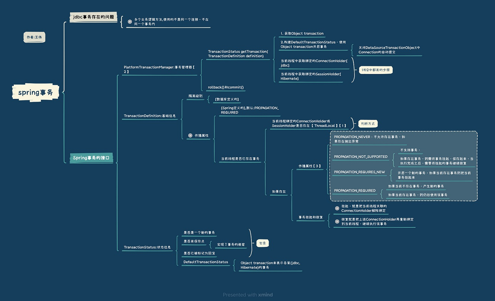

<!-- more -->

# 三种事务模型 
+ 三种事务模型
	- 本地事务模型
		+ 事务全部交给数据库来管理
	- 编程式事务模型
		+ 事务的提交和回滚操作完全交给开发人员
		+ TransactionTemplate 
			+ TransactionCallback中执行业务代码
			+ 事务代码和业务代码可以实现分离的原理【1】
	- 声明式事务模型【AOP】
		+ 事务的提交和回滚操作全部交给Spring来管理
		+ 事务拦截器TransactionInterceptor
			+ 事务管理器transactionManager【2】
			+ 事务配置的提供者transactionAttributes【3】  
				业务方法+传播属性  
			+ 代理的对象target  
				业务对象  

# 参考
1. 分布式事务系列（1.1）Spring事务管理器PlatformTransactionManager 乒乓狂魔
2. 分布式事务系列（1.2）Spring的事务体系 乒乓狂魔
