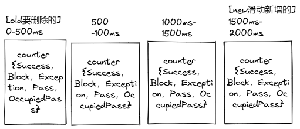

<p></p>
<!-- more -->

# Sentinel
### 限流 API [4]
1. 定义资源
   资源：可以是任何东西，一个服务，服务里的方法，甚至是一段代码。
``` Java
try (Entry entry = SphU.entry("HelloWorld")) {
    // Your business logic here.
    System.out.println("hello world");
} catch (BlockException e) {
    // Handle rejected request.
    e.printStackTrace();
}
// try-with-resources auto exit
```
``` Java
@SentinelResource("HelloWorld")
public void helloWorld() {
    // 资源中的逻辑
    System.out.println("hello world");
}
```

2. 定义规则
   规则：Sentinel 支持以下几种规则：
   流量控制规则、熔断降级规则、系统保护规则、来源访问控制规则和 热点参数规则。  
``` Java
private void initSystemRule() {
    List<SystemRule> rules = new ArrayList<>();
    SystemRule rule = new SystemRule();  // 规则
    rule.setHighestSystemLoad(10);
    rules.add(rule);
    SystemRuleManager.loadRules(rules);
}
```
``` Java
FlowRuleManager.loadRules(List<FlowRule> rules); // 流控规则
DegradeRuleManager.loadRules(List<DegradeRule> rules); // 降级规则
SystemRuleManager.loadRules(List<SystemRule> rules); // 系统规则
AuthorityRuleManager.loadRules(List<AuthorityRule> rules); // 授权规则
```

### 限流 类型 [2]
  - 直接失败  [滑动时间窗口]
  - Warmup 预热 [令牌桶算法]
  - 限流排队  [漏桶算法]

### 分布式限流 [1]

### 滑动窗口  [2]



核心代码  LeapArray.java 

```  Java
        /*
         * Get bucket item at given time from the array.
         *
         * (1) Bucket is absent, then just create a new bucket and CAS update to circular array.
         * (2) Bucket is up-to-date, then just return the bucket.
         * (3) Bucket is deprecated, then reset current bucket.
         */
        while (true) {
            WindowWrap<T> old = array.get(idx);
            if (old == null) { /// 初始化一个窗口
                /*
                 *     B0       B1      B2    NULL      B4
                 * ||_______|_______|_______|_______|_______||___
                 * 200     400     600     800     1000    1200  timestamp
                 *                             ^
                 *                          time=888
                 *            bucket is empty, so create new and update
                 *
                 * If the old bucket is absent, then we create a new bucket at {@code windowStart},
                 * then try to update circular array via a CAS operation. Only one thread can
                 * succeed to update, while other threads yield its time slice.
                 */
                WindowWrap<T> window = new WindowWrap<T>(windowLengthInMs, windowStart, newEmptyBucket(timeMillis));
                if (array.compareAndSet(idx, null, window)) {
                    // Successfully updated, return the created bucket.
                    return window;
                } else {
                    // Contention failed, the thread will yield its time slice to wait for bucket available.
                    Thread.yield();
                }
            } else if (windowStart == old.windowStart()) { /// 返回老的窗口
                /*
                 *     B0       B1      B2     B3      B4
                 * ||_______|_______|_______|_______|_______||___
                 * 200     400     600     800     1000    1200  timestamp
                 *                             ^
                 *                          time=888
                 *            startTime of Bucket 3: 800, so it's up-to-date
                 *
                 * If current {@code windowStart} is equal to the start timestamp of old bucket,
                 * that means the time is within the bucket, so directly return the bucket.
                 */
                return old;
            } else if (windowStart > old.windowStart()) {  /// 滚动: 重置老的窗口, 增加新的窗口
                /*
                 *   (old)
                 *             B0       B1      B2    NULL      B4
                 * |_______||_______|_______|_______|_______|_______||___
                 * ...    1200     1400    1600    1800    2000    2200  timestamp
                 *                              ^
                 *                           time=1676
                 *          startTime of Bucket 2: 400, deprecated, should be reset
                 *
                 * If the start timestamp of old bucket is behind provided time, that means
                 * the bucket is deprecated. We have to reset the bucket to current {@code windowStart}.
                 * Note that the reset and clean-up operations are hard to be atomic,
                 * so we need a update lock to guarantee the correctness of bucket update.
                 *
                 * The update lock is conditional (tiny scope) and will take effect only when
                 * bucket is deprecated, so in most cases it won't lead to performance loss.
                 */
                if (updateLock.tryLock()) {
                    try {
                        // Successfully get the update lock, now we reset the bucket.
                        return resetWindowTo(old, windowStart);  /// 清零重置old窗口
                    } finally {
                        updateLock.unlock();
                    }
                } else {
                    // Contention failed, the thread will yield its time slice to wait for bucket available.
                    Thread.yield();
                }
            } else if (windowStart < old.windowStart()) {  /// 时钟回拨
                // Should not go through here, as the provided time is already behind.
                return new WindowWrap<T>(windowLengthInMs, windowStart, newEmptyBucket(timeMillis));
            }
        }
    }
```

# Sentinel vs. Hystrix vs. resilience4j [3]

|                | Sentinel                                                     | Hystrix                 | resilience4j                     |
| -------------- | ------------------------------------------------------------ | ----------------------- | -------------------------------- |
| 隔离策略       | 信号量隔离（并发线程数限流）                                 | 线程池隔离/信号量隔离   | 信号量隔离                       |
| 熔断降级策略   | 基于响应时间、异常比率、异常数等                             | 异常比率模式、超时熔断  | 基于异常比率、响应时间           |
| 实时统计实现   | 滑动窗口（LeapArray）                                        | 滑动窗口（基于 RxJava） | Ring Bit Buffer                  |
| 动态规则配置   | 支持[多种配置源](https://github.com/alibaba/Sentinel/wiki/动态规则扩展#datasource-扩展) | 支持多种数据源          | 有限支持                         |
| 扩展性         | 丰富的 SPI 扩展接口                                          | 插件的形式              | 接口的形式                       |
| 基于注解的支持 | 支持                                                         | 支持                    | 支持                             |
| 限流           | 基于 QPS，支持基于调用关系的限流                             | 有限的支持              | Rate Limiter                     |
| 集群流量控制   | 支持                                                         | 不支持                  | 不支持                           |
| 流量整形       | 支持预热模式、匀速排队模式等多种复杂场景                     | 不支持                  | 简单的 Rate Limiter 模式         |
| 系统自适应保护 | 支持                                                         | 不支持                  | 不支持                           |
| 控制台         | 提供开箱即用的控制台，可配置规则、查看秒级监控、机器发现等   | 简单的监控查看          | 不提供控制台，可对接其它监控系统 |
| 多语言支持     | Java / C++                                                   | Java                    | Java                             |
| 开源社区状态   | 活跃                                                         | 停止维护                | 较活跃                           |


# 参考

1.  [集群流量控制](https://sentinelguard.io/zh-cn/docs/cluster-flow-control.html)
2.  [【图灵学院】2022最新B站独家分布式限流算法原理与应用讲解视频短合集](https://www.bilibili.com/video/BV1MP4y1176q?p=11)   V
3. [常用限流降级组件对比](https://github.com/alibaba/Sentinel/wiki/%E5%B8%B8%E7%94%A8%E9%99%90%E6%B5%81%E9%99%8D%E7%BA%A7%E7%BB%84%E4%BB%B6%E5%AF%B9%E6%AF%94) Sentinel vs. Hystrix
4.  [sentinel （史上最全+入门教程）](https://www.cnblogs.com/crazymakercircle/p/14285001.html) ***      


99. [流控降级最佳实践](https://github.com/www6v/StabilityGuide/blob/master/docs/prevention/resilience/%E6%B5%81%E6%8E%A7%E9%99%8D%E7%BA%A7%E6%9C%80%E4%BD%B3%E5%AE%9E%E8%B7%B5.md)  阿里 未
100.   self
