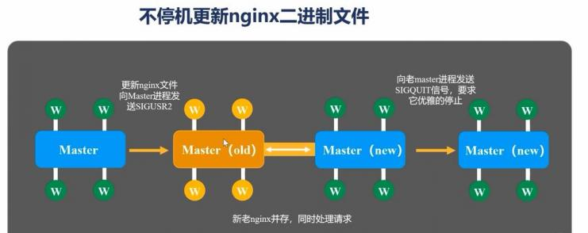
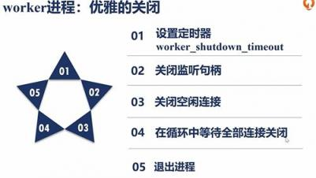

<p></p>
<!-- more -->


## Nginx总结


##  Nginx架构
1. 共享内存 Slab
   分页 4K， 8K， 16K


##  Nginx反向代理
### 类型
+ 带权重的round-robin算法是基础 
+ hash负载均衡算法
   ip-hash算法 -> real-ip
   hash算法 -> 自定义可以hash的参数（比如?userName）
  > 问题: 如果有upstream的机器宕机， hash算法还会路由到这台机器
    解决方案：使用一致性hash(consistent),hash 环
+ least-connection算法， 如果所有节点的connection都一致，
   会退化成为round-robin算法。


### 可扩展立方体
1. X-axis 基于round-robin或者least-connected算法分发请求 -> 相对简单
2. Y-axis 基于URL对功能进行分发。 -> 相对复杂
3. Z-axis 将用户IP地址或者其他信息映射到某个特定的服务或者集群 -> 相对简单


### 多种协议反向代理
1. tcp udp 透传
2. http -> memcached , scgi, fastcgi, uwsgi, grpc, http, websocket

###  反向代理流程
修改发送到upstream机器的请求的nginx指令。


##  节点热更新
### master节点热更新



### worker节点热更新





## 域名转发到其他域名[2]
+ return 指令
+ rewrite
+ proxy_pass

## 文件下载
nginx.conf
``` 
        location /userlab.dat {
            charset  gbk;
            # alias /home/hp/home/frontend/indicator/userlab.dat;

            root /home/cms/indicator;

            if ($request_filename ~* ^.*?\.(txt)$){
            add_header Content-Disposition 'attachment';
            add_header Content-Type: 'APPLICATION/OCTET-STREAM';}

            autoindex on;
            autoindex_exact_size   off;
            autoindex_localtime    on;

        }
```

## 参考

1. [深入Nginx 思维导图](https://mp.weixin.qq.com/s?__biz=MjM5MDE0Mjc4MA==&mid=2651010416&idx=4&sn=dfa07f0e065d273b028e662e87e780ff&chksm=bdbecd238ac9443511c4e7eadf9e59cc9139fac25c52b44f7a93787b940826c5f61f06e10224&scene=27#wechat_redirect)

2. [nginx配置域名转发到其他域名的几种方法](https://blog.csdn.net/yeguxin/article/details/94020476) 

