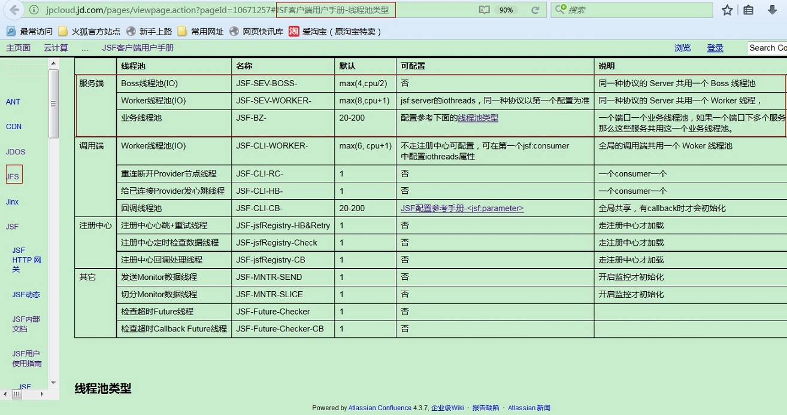

<!-- more -->

# 京东服务框架JSF 
JSF是京东基础架构组的服务化中间件产品，全名是Jingdong Service Framework（中文名：杰夫）。
JSF整体是依据netty来构建的，本文从代码层面简单介绍一下JSF服务端的线程模型。

### 1.JSF的服务端线程模型整体上是 boss线程池 + worker线程池 + 业务线程池。boss线程池和worker线程池称为Reactor线程池。

三类线程池各自的参数详见下图1。

worker线程池和业务线程池之间的关系详见下图2，在图中可以看到业务线程和worker线程是解耦的，请求放入业务线程后，IO线程即worker线程就返回了，业务线程和I/O线程隔离。 在没有解耦IO线程和业务ChannelHandler的情况时，如果在业务ChannelHandler中进行数据库等同步I/O操作，很有可能会导致IO线程中的pipeline链路被阻塞。

         

### 2. 图3是boss线程池， 线程数为Max(4,cpu/2)，用户不可以配置

         

### 3. 图4是worker线程池， 线程数为Max(8,cpu+1)，用户可以配置

         

### 4.图5和图6是业务线程池的构建，cached线程池大小是20-200，默认queue的大小是0。 任务来了直接分配线程，直到线程池满，得不到执行线程抛异常。

图7中一个服务端口对应一个业务线程池。

         

         

         

### 5. 在ChannelPipeline中ServerHandler根据服务端的配置获取对应的业务线程池，然后在ServerHandler的handlerRequest中提交业务任务，默认的任务是JSFTask。

具体实现如图8,9,10.

         

         

         

可以看到，JSF服务提供者线程模型整体还是按照boss+worker+biz这种netty官方推荐的方式构建的。

 

## 参考：

1. 京东 jsf 源代码和文档
2. Netty案例集锦之多线程篇（续） 李林锋