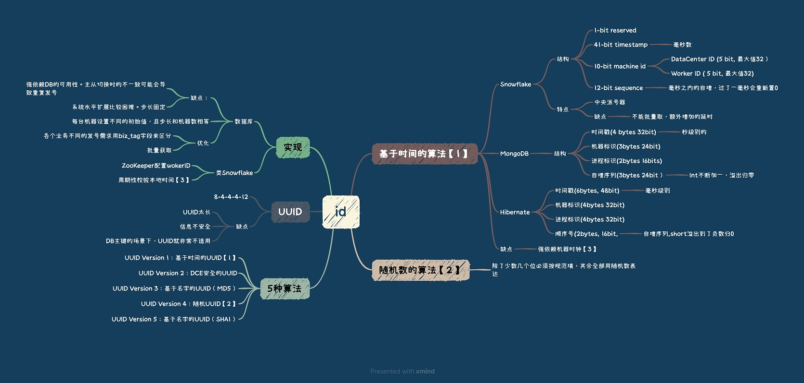

<!-- more -->

## 一. UUID
### 缺点
+ 没有业务含义
+ 不是自增的， 某些场景需要按id排序， 不适合做数据库主键。   
   ID 有序也会提升数据的写入性能， 数据库索引B+树的插入。

## 二. Snowflake

[Snowflake算法实现](https://github.com/www6v/jDemo/blob/master/src/main/java/middleware/snowflake/SnowflakeIdWorker.java)

### 实现方式：
+ 嵌入在服务器中
+ 独立的分布式id服务器

### 缺点
最大的**缺点**就是它**依赖于系统的时间戳**，一旦系统时间不准，就有可能生成重复的 ID。
所以如果我们发现系统时钟不准，就可以**让发号器暂时拒绝发号，直到时钟准确为止**。
可以使用**ntp服务器**同步服务的系统时间。

### 优化
+ 时间戳不记录毫秒而是**记录秒**，这样在一个时间区间里可以多发出几个号，避免出现分库分表时数据分配不均。 **批量id**

## 参考：

1. Leaf——美团点评分布式ID生成系统 照东
2. 服务化框架－分布式Unique ID的生成方法一览 江南白衣
3. [Leaf：美团分布式ID生成服务开源](https://tech.meituan.com/2019/03/07/open-source-project-leaf.html)
4. [发号器：如何保证分库分表后ID的全局唯一性？]()  唐扬

