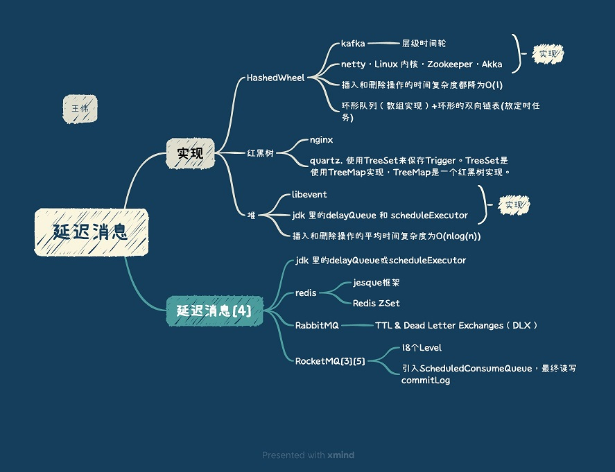

<!-- more -->

关键词：延迟消息, 时间轮, Time Wheel

## 时钟轮的应用
#####   Kafka中的应用 [1]
   存在大量的延迟操作，比如**延迟生产**、**延迟拉取**以及**延迟删除**等

#####  RPC中的应用 [6]
+ 每次创建一个 Future，我们都记录这个 Future 的创建时间与这个 Future 的超时时间，并且有一个定时任务进行检测，当这个 Future 到达超时时间并且没有被处理时，我们就对这个 Future 执行超时逻辑。
每发一次请求，都创建一个**处理请求超时的定时任务**放到时钟轮里。
+ **调用端与服务端启动超时**也可以应用到时钟轮。  
  可以在调用端启动时创建一个处理启动超时的定时任务，放到时钟轮里。  
+ RPC 框架调用端定时向服务端发送心跳，来维护连接状态，我们可以将**心跳的逻辑**封装为一个**心跳任务**，放到时钟轮里。
在定时任务的执行逻辑的最后，我们可以重设这个任务的执行时间，把它重新丢回到时钟轮里。

## 参考
1. [Kafka解惑之时间轮（TimingWheel）](https://blog.csdn.net/u013256816/article/details/80697456)  朱忠华
2. [10w定时任务，如何高效触发超时](https://mp.weixin.qq.com/s/mvFwjgxliwx808Hn_9ruEA?ptlang=2052&ADUIN=1024616676&ADSESSION=1489673030&ADTAG=CLIENT.QQ.5497_.0&ADPUBNO=26661) 58沈剑
3. [如何在MQ中实现支持任意延迟的消息？](https://www.cnblogs.com/hzmark/p/mq-delay-msg.html)
4. [延迟任务的实现总结](https://www.cnblogs.com/haoxinyue/p/6663720.html)  nick hao
5. [rocketMq-延迟消息介绍](https://www.jianshu.com/p/33aa208ea058)   晴天哥_王志 *
6. 《20 | 详解时钟轮在RPC中的应用》 何小锋
7. [时间轮原理及其在框架中的应用](https://zhuanlan.zhihu.com/p/488730353)  未
   Dubbo 心跳检测 
