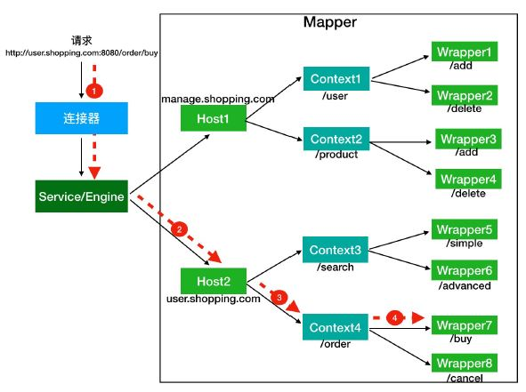
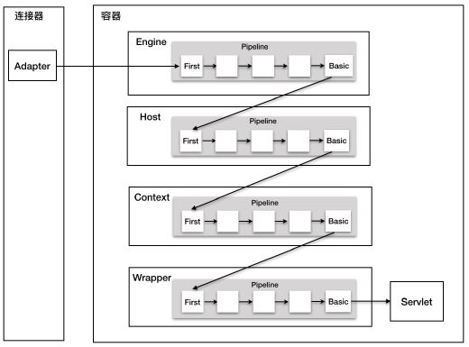

<!-- more -->

##  Tomcat 架构

tomcat组件

##  Servlet规范
+ Servlet
+ Filter
每个请求生成一个Filter链
+ Listener
定制自己的监听器来监听 **Tomcat 内部发生的各种事件**：包括 Web 应用级别的、Session 级别的和请求级别的

## 参考:
[tomcat 组件 Top level view](https://www.iteye.com/blog/onlyor-1689344)  
[深入拆解Tomcat & Jetty - 06 | Tomcat系统架构（下）：聊聊多层容器的设计]() 李号双  
[深入拆解Tomcat & Jetty - 26 | Context容器（下）：Tomcat如何实现Servlet规范？]() 李号双  