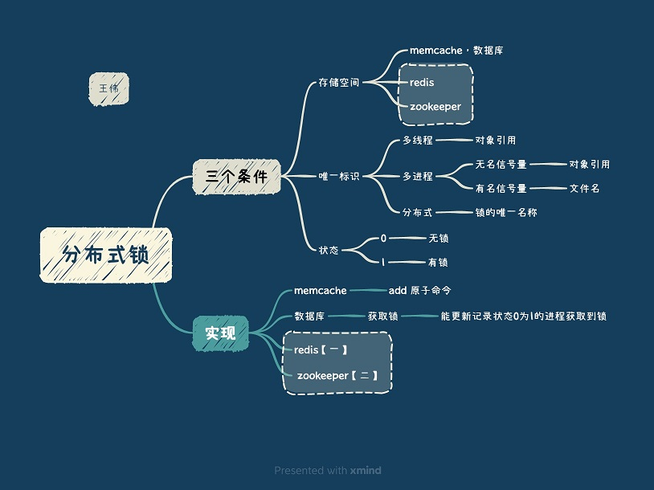

<!-- more -->

# 分布式锁

# 锁的特性 
1. 排它性
2. 超时释放锁
   zk临时目录
3. 高可用，锁集群容错[图2]，
   安全性[3]，
4. 可重入锁, 避免死锁 [4]
5. 乐观锁, 悲观锁[6][图2]

#  实现
### Redis[5]
### Zookeeper[4]

# 参考
1. [分布式系统互斥性与幂等性问题的分析与解决](https://tech.meituan.com/2016/09/29/distributed-system-mutually-exclusive-idempotence-cerberus-gtis.html) 点评 蒋谞 
2. 漫画：什么是分布式锁？ 程序员小灰
3. [分布式服务总结 分布式锁](https://www.jianshu.com/p/31e85a18a9e7)  
   通过栅栏(fencing)使得锁更安全, fencing token
   [How to do distributed locking](http://martin.kleppmann.com/2016/02/08/how-to-do-distributed-locking.html) Martin Kleppmann  
4.  self
5. [Go to Page](redisDistKey.md)  self
6. [Redis分布式锁实现秒杀业务(乐观锁、悲观锁)](https://www.cnblogs.com/jasonZh/p/9522772.html)  最后
    乐观锁: jedis的watch方法

100. [SOFAJRaft-RheaKV 分布式锁实现剖析 | SOFAJRaft 实现原理](https://mp.weixin.qq.com/s/ahcbgxWVVmRwrH9Y4-gXBA)   SOFALab 米麒麟 未

 

