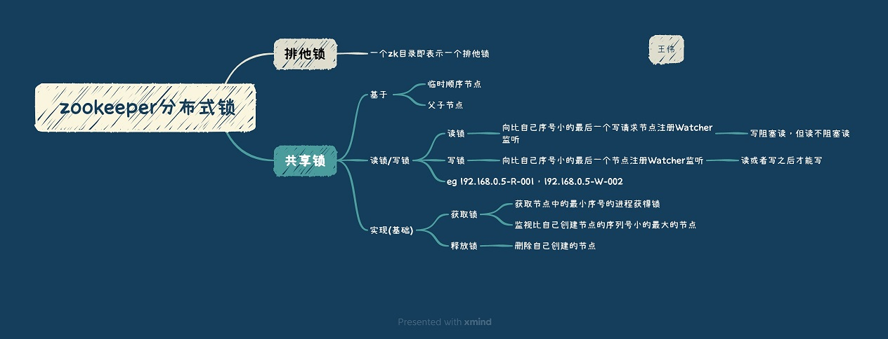

<p></p>
<!-- more -->


#  基于ZK的分布式锁   



###  可重入性[2][3]-实现方式
[chat]

在ZooKeeper中，分布式锁的可重入性是通过在锁节点的数据中保存一个拥有者ID和计数器来实现的。具体来说，当一个客户端第一次获取锁时，它会在锁节点的数据中设置一个拥有者ID，并将计数器设置为1。当这个客户端再次请求获取锁时，它会检查锁节点的数据中是否已经设置了拥有者ID，并且该ID是否与自己相同。如果相同，则将计数器加1，表示该客户端已经多次获取了锁；如果不同，则该客户端需要等待锁的释放。

通过保存拥有者ID和计数器，ZooKeeper可以轻松地实现分布式锁的可重入性。当一个客户端多次获取锁时，它只需要检查锁节点的数据中保存的拥有者ID是否与自己相同，并且计数器是否大于等于1即可。如果满足条件，则说明该客户端已经拥有了锁，并且可以继续执行操作；否则，该客户端需要等待锁的释放。

需要注意的是，为了避免死锁，ZooKeeper分布式锁的可重入性实现中还需要考虑锁的释放顺序。具体来说，当一个客户端释放锁时，需要按照获取锁的顺序依次释放所有的锁，从而避免死锁的发生。

总之，ZooKeeper分布式锁的可重入性是通过在锁节点的数据中保存拥有者ID和计数器来实现的。这种实现方式简单、高效，并且可以避免死锁的发生。

[endchat]

[chat]  总结: 在ZooKeeper中，分布式锁的可重入性是如何实现的   

具体来说，它通过在锁节点的数据中保存**拥有者ID和计数器**来判断一个客户端是否已经持有锁，并且在客户端多次获取锁时，可以通过增加计数器的方式来实现可重入性。为了避免死锁，ZooKeeper分布式锁的实现中还需要考虑锁的释放顺序，即按照获取锁的顺序依次释放所有的锁。这种实现方式简单、高效，并且可以避免死锁的发生。

[endchat]

### 可重入性[2]-代码实现
```
@Override

public boolean lock() {

    //可重入的判断

    synchronized (this) {

        if (lockCount.get() == 0) {

            thread = Thread.currentThread();

            lockCount.incrementAndGet();

        } else {

            if (!thread.equals(Thread.currentThread())) { ## 本线程是否已经占有锁

            return false;

        }

        lockCount.incrementAndGet();

        return true;

      }
   }
   //....
}
```

### 羊群效应 优化 [1]

# 参考
1. 《从Paxos到Zookeeper分布式一致性原理与实践》 倪超 6.1.7节
2. [Zookeeper 分布式锁 （图解+秒懂+史上最全）](https://www.cnblogs.com/crazymakercircle/p/14504520.html) *** 
3. [分布式锁（一）基于Zookeeper实现可重入分布式锁](https://blog.csdn.net/u013278314/article/details/82715716)  *

